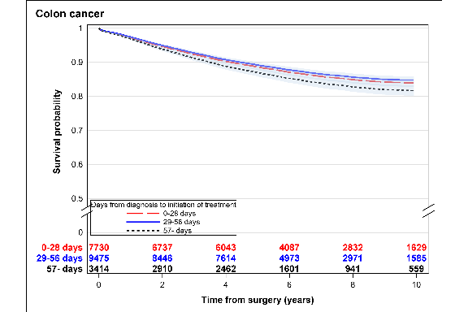
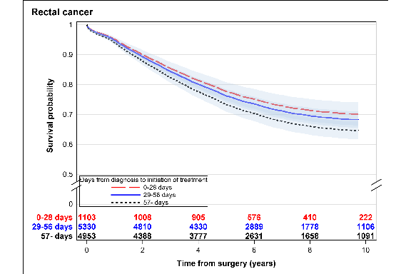
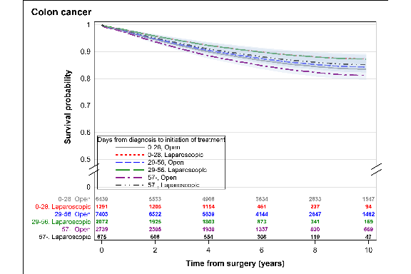
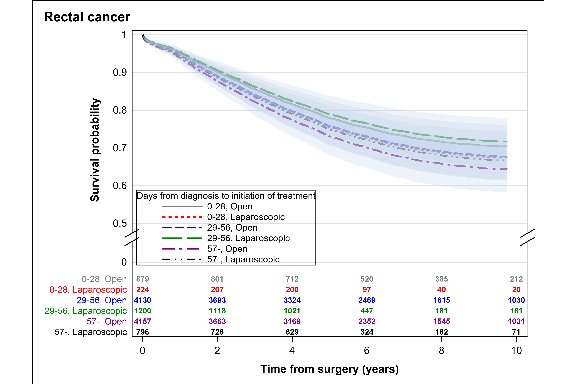
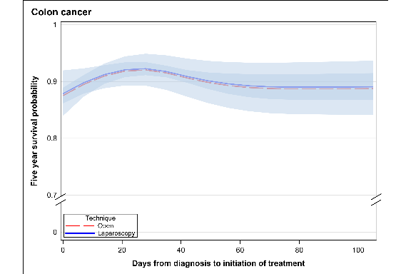
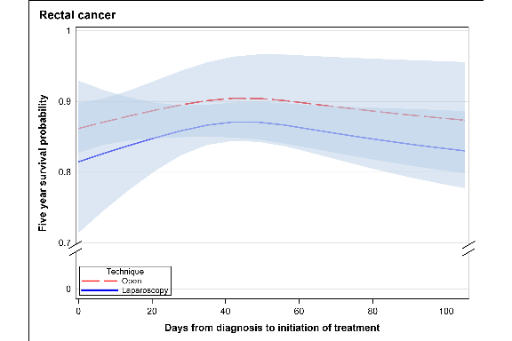
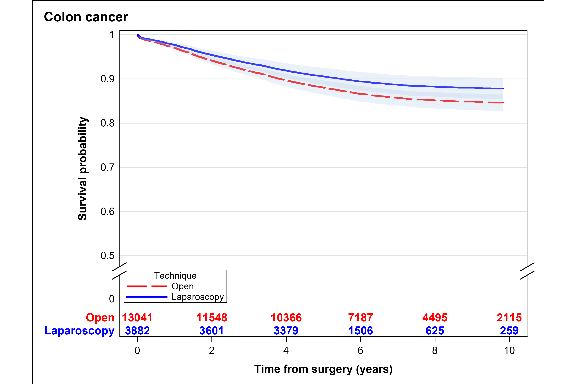
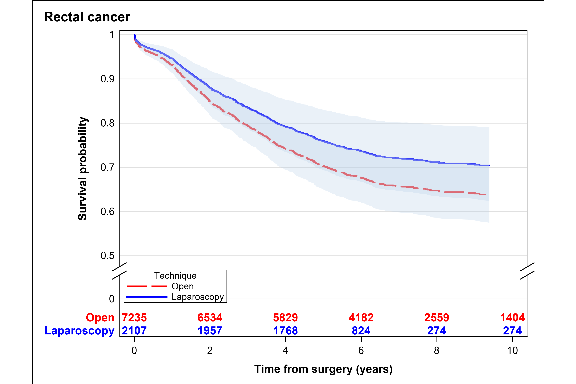

<!-- README.md is generated from README.Rmd. Please edit that file -->

# “Survival in relation to time to start of curative treatment of colon and rectal cancer is confounded by increased survival after laparoscopic surgery: A national register-based observational non-inferiority study”

Daniel Rydbeck, David Bock, Eva Haglind, Eva Angenete, Aron Onerup

# Description

Registry datasets was located on Colorectal Cancer data Base Sweden
(CRCBaSe) external server at Karolinska Institutet (KI), Sweden. Data
management and statistical analysis was performed via VPN Remote Access.
SAS software was used.

*Individual patient level data can not be publicly available or shared
due to restrictions in the ethics approval agreement (Ethical permission
was obtained from the Regional ethical committee in Stockholm February
26th 2014, Dnr 2014/71-31/1 for creation of the data base)*. The current
study was registered at ClinicalTrials.gov with trial registration
number NCT04571047, date of first registry September 30 2020.

# SAS code

The following SAS program code programs for data management and
statistical analysis are available:  
**1. A1\_analys\_set\_derivation**  
Derive analysis set based on inclusion and exclusion criteria.  
**2. A2\_Read\_data\_Fix\_derivation**  
Create analysis data set and derive relevant variables (covariates,
exposure and endpoints).  
**3. A3\_Create\_Multiple\_imputations**  
Create data set with multiple imputations (50) on the missing values of
the covariates used for confounder adjustment.  
**4. A4\_demography**  
Demography and patient characteristics.  
**5. B1\_Primary\_Outcome\_Surv\_curves**  
Adjusted survival curves for primary endpoint: all-cause mortality  
**6. B2\_Regressions\_models**  
Regression analyses for primary and secondary endpoints  
**7. B3\_Dose\_response\_Survival**  
Estimate dose-response relationship between time from diagnosis to start
of treatment and 5 year survival  
**8. C1\_PostHoc\_1\_Surv\_curves**  
Post hoc analysis 1: Heterogeneity in the relationship time from
diagnosis to start of treatment and all-cause mortality with rehard to
surgical technique (Laparoscopy/Open). Adjusted survival curves  
**10. C2\_PostHoc\_1\_Cox\_regression**  
Post hoc analysis 1: Heterogeneity in the relationship time from
diagnosis to start of treatment and all-cause mortality with regard to
surgical technique (Laparoscopy/Open). Cox regression.  
**11. D\_PostHoc\_2\_Surv\_curves\_Cox\_regression**  
Post hoc analysis 2: The relationship between surgical technique
(Laparoscopy/Open) and all-cause mortality. Adjusted survival curves and
Cox regression.

# Statistical analysis output

## Patient flow chart

Number of patients in the analysis set: 32363.  
<table class=" lightable-classic" style="font-family: Cambria; width: auto !important; margin-left: auto; margin-right: auto;">
<caption>
</caption>
<thead>
<tr>
<th style="text-align:right;">
in
</th>
<th style="text-align:left;">
comment
</th>
<th style="text-align:right;">
out
</th>
</tr>
</thead>
<tbody>
<tr>
<td style="text-align:right;">
52868
</td>
<td style="text-align:left;">
Colon or rectal cancer
</td>
<td style="text-align:right;">
NA
</td>
</tr>
<tr>
<td style="text-align:right;">
34840
</td>
<td style="text-align:left;">
Elective surgery with a curative intent 2008-2016
</td>
<td style="text-align:right;">
-18028
</td>
</tr>
<tr>
<td style="text-align:right;">
34799
</td>
<td style="text-align:left;">
Diagnosed for other cancer diagnosis during the last 5 years excl skin
tumours (ICD C43 or C44).Patients with a previous diagnose of
C18/C19/C20 (colorectal cancer) were not excluded
</td>
<td style="text-align:right;">
-41
</td>
</tr>
<tr>
<td style="text-align:right;">
34777
</td>
<td style="text-align:left;">
Local tumour excision
</td>
<td style="text-align:right;">
-22
</td>
</tr>
<tr>
<td style="text-align:right;">
32538
</td>
<td style="text-align:left;">
Metastasized disease at diagnosis
</td>
<td style="text-align:right;">
-2239
</td>
</tr>
<tr>
<td style="text-align:right;">
32363
</td>
<td style="text-align:left;">
Several rows,  
take first date
</td>
<td style="text-align:right;">
-175
</td>
</tr>
</tbody>
</table>

## Demography and patient characteristics

<table class=" lightable-classic" style="font-family: Cambria; width: auto !important; margin-left: auto; margin-right: auto;">
<caption>
</caption>
<thead>
<tr>
<th style="text-align:left;">
*NAME*
</th>
<th style="text-align:left;">
*LABEL*
</th>
<th style="text-align:left;">
newcol
</th>
<th style="text-align:right;">
location
</th>
<th style="text-align:left;">
\_0\_28\_days
</th>
<th style="text-align:left;">
\_29\_56\_days
</th>
<th style="text-align:left;">
\_57\_\_days
</th>
<th style="text-align:left;">
Total
</th>
<th style="text-align:left;">
Missing
</th>
<th style="text-align:right;">
n
</th>
</tr>
</thead>
<tbody>
<tr>
<td style="text-align:left;">
A2\_lapa
</td>
<td style="text-align:left;">
A2\_lapa\_Värde
</td>
<td style="text-align:left;">
.
</td>
<td style="text-align:right;">
1
</td>
<td style="text-align:left;">
38(0%)
</td>
<td style="text-align:left;">
46(0%)
</td>
<td style="text-align:left;">
18(1%)
</td>
<td style="text-align:left;">
109(1%)
</td>
<td style="text-align:left;">
7(3%)
</td>
<td style="text-align:right;">
1
</td>
</tr>
<tr>
<td style="text-align:left;">
A2\_lapa
</td>
<td style="text-align:left;">
A2\_lapa\_Värde
</td>
<td style="text-align:left;">
Laparoscopy
</td>
<td style="text-align:right;">
1
</td>
<td style="text-align:left;">
1284(17%)
</td>
<td style="text-align:left;">
2066(22%)
</td>
<td style="text-align:left;">
673(20%)
</td>
<td style="text-align:left;">
4058(19%)
</td>
<td style="text-align:left;">
35(16%)
</td>
<td style="text-align:right;">
3
</td>
</tr>
<tr>
<td style="text-align:left;">
A2\_lapa
</td>
<td style="text-align:left;">
A2\_lapa\_Värde
</td>
<td style="text-align:left;">
Open
</td>
<td style="text-align:right;">
1
</td>
<td style="text-align:left;">
6408(83%)
</td>
<td style="text-align:left;">
7363(78%)
</td>
<td style="text-align:left;">
2723(80%)
</td>
<td style="text-align:left;">
16669(80%)
</td>
<td style="text-align:left;">
175(81%)
</td>
<td style="text-align:right;">
5
</td>
</tr>
<tr>
<td style="text-align:left;">
BMI
</td>
<td style="text-align:left;">
</td>
<td style="text-align:left;">
Median(Q1; Q3)
</td>
<td style="text-align:right;">
1
</td>
<td style="text-align:left;">
25(23;28)
</td>
<td style="text-align:left;">
26(23;29)
</td>
<td style="text-align:left;">
25(23;29)
</td>
<td style="text-align:left;">
25(23;29)
</td>
<td style="text-align:left;">
26(23;29)
</td>
<td style="text-align:right;">
1
</td>
</tr>
<tr>
<td style="text-align:left;">
BMI
</td>
<td style="text-align:left;">
</td>
<td style="text-align:left;">
Min; max
</td>
<td style="text-align:right;">
1
</td>
<td style="text-align:left;">
1;692
</td>
<td style="text-align:left;">
14;508
</td>
<td style="text-align:left;">
13;477
</td>
<td style="text-align:left;">
1;692
</td>
<td style="text-align:left;">
17;85
</td>
<td style="text-align:right;">
1
</td>
</tr>
<tr>
<td style="text-align:left;">
CCI\_cat
</td>
<td style="text-align:left;">
</td>
<td style="text-align:left;">
0
</td>
<td style="text-align:right;">
1
</td>
<td style="text-align:left;">
4699(61%)
</td>
<td style="text-align:left;">
5719(60%)
</td>
<td style="text-align:left;">
1836(54%)
</td>
<td style="text-align:left;">
12381(59%)
</td>
<td style="text-align:left;">
127(59%)
</td>
<td style="text-align:right;">
7
</td>
</tr>
<tr>
<td style="text-align:left;">
CCI\_cat
</td>
<td style="text-align:left;">
</td>
<td style="text-align:left;">
1
</td>
<td style="text-align:right;">
1
</td>
<td style="text-align:left;">
1040(13%)
</td>
<td style="text-align:left;">
1290(14%)
</td>
<td style="text-align:left;">
488(14%)
</td>
<td style="text-align:left;">
2848(14%)
</td>
<td style="text-align:left;">
30(14%)
</td>
<td style="text-align:right;">
9
</td>
</tr>
<tr>
<td style="text-align:left;">
CCI\_cat
</td>
<td style="text-align:left;">
</td>
<td style="text-align:left;">
2
</td>
<td style="text-align:right;">
1
</td>
<td style="text-align:left;">
1099(14%)
</td>
<td style="text-align:left;">
1345(14%)
</td>
<td style="text-align:left;">
520(15%)
</td>
<td style="text-align:left;">
2996(14%)
</td>
<td style="text-align:left;">
32(15%)
</td>
<td style="text-align:right;">
11
</td>
</tr>
<tr>
<td style="text-align:left;">
CCI\_cat
</td>
<td style="text-align:left;">
</td>
<td style="text-align:left;">
3
</td>
<td style="text-align:right;">
1
</td>
<td style="text-align:left;">
892(12%)
</td>
<td style="text-align:left;">
1121(12%)
</td>
<td style="text-align:left;">
570(17%)
</td>
<td style="text-align:left;">
2611(13%)
</td>
<td style="text-align:left;">
28(13%)
</td>
<td style="text-align:right;">
13
</td>
</tr>
<tr>
<td style="text-align:left;">
CCI\_weight
</td>
<td style="text-align:left;">
</td>
<td style="text-align:left;">
Median(Q1; Q3)
</td>
<td style="text-align:right;">
1
</td>
<td style="text-align:left;">
0(0;2)
</td>
<td style="text-align:left;">
0(0;2)
</td>
<td style="text-align:left;">
0(0;2)
</td>
<td style="text-align:left;">
0(0;2)
</td>
<td style="text-align:left;">
0(0;2)
</td>
<td style="text-align:right;">
3
</td>
</tr>
<tr>
<td style="text-align:left;">
CCI\_weight
</td>
<td style="text-align:left;">
</td>
<td style="text-align:left;">
Min; max
</td>
<td style="text-align:right;">
1
</td>
<td style="text-align:left;">
0;14
</td>
<td style="text-align:left;">
0;16
</td>
<td style="text-align:left;">
0;14
</td>
<td style="text-align:left;">
0;16
</td>
<td style="text-align:left;">
0;11
</td>
<td style="text-align:right;">
3
</td>
</tr>
<tr>
<td style="text-align:left;">
DispInkKE0
</td>
<td style="text-align:left;">
the mean, KE04\_1
</td>
<td style="text-align:left;">
Median(Q1; Q3)
</td>
<td style="text-align:right;">
1
</td>
<td style="text-align:left;">
1830(1409;2616)
</td>
<td style="text-align:left;">
1872(1445;2651)
</td>
<td style="text-align:left;">
1788(1399;2509)
</td>
<td style="text-align:left;">
1840(1424;2619)
</td>
<td style="text-align:left;">
1901(1427;2634)
</td>
<td style="text-align:right;">
5
</td>
</tr>
<tr>
<td style="text-align:left;">
DispInkKE0
</td>
<td style="text-align:left;">
the mean, KE04\_1
</td>
<td style="text-align:left;">
Min; max
</td>
<td style="text-align:right;">
1
</td>
<td style="text-align:left;">
-42094;25560
</td>
<td style="text-align:left;">
-13048;226973
</td>
<td style="text-align:left;">
-559;24644
</td>
<td style="text-align:left;">
-42094;226973
</td>
<td style="text-align:left;">
0;148944
</td>
<td style="text-align:right;">
5
</td>
</tr>
<tr>
<td style="text-align:left;">
YLAP
</td>
<td style="text-align:left;">
</td>
<td style="text-align:left;">
.
</td>
<td style="text-align:right;">
1
</td>
<td style="text-align:left;">
38(0%)
</td>
<td style="text-align:left;">
46(0%)
</td>
<td style="text-align:left;">
18(1%)
</td>
<td style="text-align:left;">
109(1%)
</td>
<td style="text-align:left;">
7(3%)
</td>
<td style="text-align:right;">
15
</td>
</tr>
<tr>
<td style="text-align:left;">
YLAP
</td>
<td style="text-align:left;">
</td>
<td style="text-align:left;">
-2012, Laparoscopy
</td>
<td style="text-align:right;">
1
</td>
<td style="text-align:left;">
279(4%)
</td>
<td style="text-align:left;">
458(5%)
</td>
<td style="text-align:left;">
153(4%)
</td>
<td style="text-align:left;">
901(4%)
</td>
<td style="text-align:left;">
11(5%)
</td>
<td style="text-align:right;">
17
</td>
</tr>
<tr>
<td style="text-align:left;">
YLAP
</td>
<td style="text-align:left;">
</td>
<td style="text-align:left;">
-2012, Open
</td>
<td style="text-align:right;">
1
</td>
<td style="text-align:left;">
4305(56%)
</td>
<td style="text-align:left;">
4220(45%)
</td>
<td style="text-align:left;">
1580(46%)
</td>
<td style="text-align:left;">
10212(49%)
</td>
<td style="text-align:left;">
107(49%)
</td>
<td style="text-align:right;">
19
</td>
</tr>
<tr>
<td style="text-align:left;">
YLAP
</td>
<td style="text-align:left;">
</td>
<td style="text-align:left;">
2013-, Laparoscopy
</td>
<td style="text-align:right;">
1
</td>
<td style="text-align:left;">
1005(13%)
</td>
<td style="text-align:left;">
1608(17%)
</td>
<td style="text-align:left;">
520(15%)
</td>
<td style="text-align:left;">
3157(15%)
</td>
<td style="text-align:left;">
24(11%)
</td>
<td style="text-align:right;">
21
</td>
</tr>
<tr>
<td style="text-align:left;">
YLAP
</td>
<td style="text-align:left;">
</td>
<td style="text-align:left;">
2013-, Open
</td>
<td style="text-align:right;">
1
</td>
<td style="text-align:left;">
2103(27%)
</td>
<td style="text-align:left;">
3143(33%)
</td>
<td style="text-align:left;">
1143(33%)
</td>
<td style="text-align:left;">
6457(31%)
</td>
<td style="text-align:left;">
68(31%)
</td>
<td style="text-align:right;">
23
</td>
</tr>
<tr>
<td style="text-align:left;">
Year\_dik
</td>
<td style="text-align:left;">
</td>
<td style="text-align:left;">
2008-2012
</td>
<td style="text-align:right;">
1
</td>
<td style="text-align:left;">
4601(60%)
</td>
<td style="text-align:left;">
4700(50%)
</td>
<td style="text-align:left;">
1745(51%)
</td>
<td style="text-align:left;">
11169(54%)
</td>
<td style="text-align:left;">
123(57%)
</td>
<td style="text-align:right;">
25
</td>
</tr>
<tr>
<td style="text-align:left;">
Year\_dik
</td>
<td style="text-align:left;">
</td>
<td style="text-align:left;">
2013-2016
</td>
<td style="text-align:right;">
1
</td>
<td style="text-align:left;">
3129(40%)
</td>
<td style="text-align:left;">
4775(50%)
</td>
<td style="text-align:left;">
1669(49%)
</td>
<td style="text-align:left;">
9667(46%)
</td>
<td style="text-align:left;">
94(43%)
</td>
<td style="text-align:right;">
27
</td>
</tr>
<tr>
<td style="text-align:left;">
Ymethod
</td>
<td style="text-align:left;">
</td>
<td style="text-align:left;">
2008\_.
</td>
<td style="text-align:right;">
1
</td>
<td style="text-align:left;">
3(0%)
</td>
<td style="text-align:left;">
2(0%)
</td>
<td style="text-align:left;">
2(0%)
</td>
<td style="text-align:left;">
7(0%)
</td>
<td style="text-align:left;">
</td>
<td style="text-align:right;">
29
</td>
</tr>
<tr>
<td style="text-align:left;">
Ymethod
</td>
<td style="text-align:left;">
</td>
<td style="text-align:left;">
2008 Open
</td>
<td style="text-align:right;">
1
</td>
<td style="text-align:left;">
996(13%)
</td>
<td style="text-align:left;">
783(8%)
</td>
<td style="text-align:left;">
275(8%)
</td>
<td style="text-align:left;">
2059(10%)
</td>
<td style="text-align:left;">
5(2%)
</td>
<td style="text-align:right;">
31
</td>
</tr>
<tr>
<td style="text-align:left;">
Ymethod
</td>
<td style="text-align:left;">
</td>
<td style="text-align:left;">
2008 Lap
</td>
<td style="text-align:right;">
1
</td>
<td style="text-align:left;">
36(0%)
</td>
<td style="text-align:left;">
46(0%)
</td>
<td style="text-align:left;">
21(1%)
</td>
<td style="text-align:left;">
103(0%)
</td>
<td style="text-align:left;">
</td>
<td style="text-align:right;">
33
</td>
</tr>
<tr>
<td style="text-align:left;">
Ymethod
</td>
<td style="text-align:left;">
</td>
<td style="text-align:left;">
2009\_.
</td>
<td style="text-align:right;">
1
</td>
<td style="text-align:left;">
2(0%)
</td>
<td style="text-align:left;">
</td>
<td style="text-align:left;">
1(0%)
</td>
<td style="text-align:left;">
4(0%)
</td>
<td style="text-align:left;">
1(0%)
</td>
<td style="text-align:right;">
35
</td>
</tr>
<tr>
<td style="text-align:left;">
Ymethod
</td>
<td style="text-align:left;">
</td>
<td style="text-align:left;">
2009 Open
</td>
<td style="text-align:right;">
1
</td>
<td style="text-align:left;">
924(12%)
</td>
<td style="text-align:left;">
825(9%)
</td>
<td style="text-align:left;">
338(10%)
</td>
<td style="text-align:left;">
2106(10%)
</td>
<td style="text-align:left;">
19(9%)
</td>
<td style="text-align:right;">
37
</td>
</tr>
<tr>
<td style="text-align:left;">
Ymethod
</td>
<td style="text-align:left;">
</td>
<td style="text-align:left;">
2009 Lap
</td>
<td style="text-align:right;">
1
</td>
<td style="text-align:left;">
37(0%)
</td>
<td style="text-align:left;">
58(1%)
</td>
<td style="text-align:left;">
14(0%)
</td>
<td style="text-align:left;">
111(1%)
</td>
<td style="text-align:left;">
2(1%)
</td>
<td style="text-align:right;">
39
</td>
</tr>
<tr>
<td style="text-align:left;">
Ymethod
</td>
<td style="text-align:left;">
</td>
<td style="text-align:left;">
2010\_.
</td>
<td style="text-align:right;">
1
</td>
<td style="text-align:left;">
10(0%)
</td>
<td style="text-align:left;">
11(0%)
</td>
<td style="text-align:left;">
5(0%)
</td>
<td style="text-align:left;">
28(0%)
</td>
<td style="text-align:left;">
2(1%)
</td>
<td style="text-align:right;">
41
</td>
</tr>
<tr>
<td style="text-align:left;">
Ymethod
</td>
<td style="text-align:left;">
</td>
<td style="text-align:left;">
2010 Open
</td>
<td style="text-align:right;">
1
</td>
<td style="text-align:left;">
826(11%)
</td>
<td style="text-align:left;">
874(9%)
</td>
<td style="text-align:left;">
351(10%)
</td>
<td style="text-align:left;">
2073(10%)
</td>
<td style="text-align:left;">
22(10%)
</td>
<td style="text-align:right;">
43
</td>
</tr>
<tr>
<td style="text-align:left;">
Ymethod
</td>
<td style="text-align:left;">
</td>
<td style="text-align:left;">
2010 Lap
</td>
<td style="text-align:right;">
1
</td>
<td style="text-align:left;">
54(1%)
</td>
<td style="text-align:left;">
73(1%)
</td>
<td style="text-align:left;">
27(1%)
</td>
<td style="text-align:left;">
155(1%)
</td>
<td style="text-align:left;">
1(0%)
</td>
<td style="text-align:right;">
45
</td>
</tr>
<tr>
<td style="text-align:left;">
Ymethod
</td>
<td style="text-align:left;">
</td>
<td style="text-align:left;">
2011\_.
</td>
<td style="text-align:right;">
1
</td>
<td style="text-align:left;">
2(0%)
</td>
<td style="text-align:left;">
3(0%)
</td>
<td style="text-align:left;">
1(0%)
</td>
<td style="text-align:left;">
6(0%)
</td>
<td style="text-align:left;">
</td>
<td style="text-align:right;">
47
</td>
</tr>
<tr>
<td style="text-align:left;">
Ymethod
</td>
<td style="text-align:left;">
</td>
<td style="text-align:left;">
2011 Open
</td>
<td style="text-align:right;">
1
</td>
<td style="text-align:left;">
839(11%)
</td>
<td style="text-align:left;">
855(9%)
</td>
<td style="text-align:left;">
327(10%)
</td>
<td style="text-align:left;">
2052(10%)
</td>
<td style="text-align:left;">
31(14%)
</td>
<td style="text-align:right;">
49
</td>
</tr>
<tr>
<td style="text-align:left;">
Ymethod
</td>
<td style="text-align:left;">
</td>
<td style="text-align:left;">
2011 Lap
</td>
<td style="text-align:right;">
1
</td>
<td style="text-align:left;">
62(1%)
</td>
<td style="text-align:left;">
128(1%)
</td>
<td style="text-align:left;">
37(1%)
</td>
<td style="text-align:left;">
227(1%)
</td>
<td style="text-align:left;">
</td>
<td style="text-align:right;">
51
</td>
</tr>
<tr>
<td style="text-align:left;">
Ymethod
</td>
<td style="text-align:left;">
</td>
<td style="text-align:left;">
2012\_.
</td>
<td style="text-align:right;">
1
</td>
<td style="text-align:left;">
</td>
<td style="text-align:left;">
6(0%)
</td>
<td style="text-align:left;">
3(0%)
</td>
<td style="text-align:left;">
11(0%)
</td>
<td style="text-align:left;">
2(1%)
</td>
<td style="text-align:right;">
53
</td>
</tr>
<tr>
<td style="text-align:left;">
Ymethod
</td>
<td style="text-align:left;">
</td>
<td style="text-align:left;">
2012 Open
</td>
<td style="text-align:right;">
1
</td>
<td style="text-align:left;">
720(9%)
</td>
<td style="text-align:left;">
883(9%)
</td>
<td style="text-align:left;">
289(8%)
</td>
<td style="text-align:left;">
1922(9%)
</td>
<td style="text-align:left;">
30(14%)
</td>
<td style="text-align:right;">
55
</td>
</tr>
<tr>
<td style="text-align:left;">
Ymethod
</td>
<td style="text-align:left;">
</td>
<td style="text-align:left;">
2012 Lap
</td>
<td style="text-align:right;">
1
</td>
<td style="text-align:left;">
90(1%)
</td>
<td style="text-align:left;">
153(2%)
</td>
<td style="text-align:left;">
54(2%)
</td>
<td style="text-align:left;">
305(1%)
</td>
<td style="text-align:left;">
8(4%)
</td>
<td style="text-align:right;">
57
</td>
</tr>
<tr>
<td style="text-align:left;">
Ymethod
</td>
<td style="text-align:left;">
</td>
<td style="text-align:left;">
2013\_.
</td>
<td style="text-align:right;">
1
</td>
<td style="text-align:left;">
7(0%)
</td>
<td style="text-align:left;">
6(0%)
</td>
<td style="text-align:left;">
</td>
<td style="text-align:left;">
14(0%)
</td>
<td style="text-align:left;">
1(0%)
</td>
<td style="text-align:right;">
59
</td>
</tr>
<tr>
<td style="text-align:left;">
Ymethod
</td>
<td style="text-align:left;">
</td>
<td style="text-align:left;">
2013 Open
</td>
<td style="text-align:right;">
1
</td>
<td style="text-align:left;">
616(8%)
</td>
<td style="text-align:left;">
825(9%)
</td>
<td style="text-align:left;">
345(10%)
</td>
<td style="text-align:left;">
1799(9%)
</td>
<td style="text-align:left;">
13(6%)
</td>
<td style="text-align:right;">
61
</td>
</tr>
<tr>
<td style="text-align:left;">
Ymethod
</td>
<td style="text-align:left;">
</td>
<td style="text-align:left;">
2013 Lap
</td>
<td style="text-align:right;">
1
</td>
<td style="text-align:left;">
112(1%)
</td>
<td style="text-align:left;">
240(3%)
</td>
<td style="text-align:left;">
107(3%)
</td>
<td style="text-align:left;">
466(2%)
</td>
<td style="text-align:left;">
7(3%)
</td>
<td style="text-align:right;">
63
</td>
</tr>
<tr>
<td style="text-align:left;">
Ymethod
</td>
<td style="text-align:left;">
</td>
<td style="text-align:left;">
2014\_.
</td>
<td style="text-align:right;">
1
</td>
<td style="text-align:left;">
4(0%)
</td>
<td style="text-align:left;">
10(0%)
</td>
<td style="text-align:left;">
4(0%)
</td>
<td style="text-align:left;">
19(0%)
</td>
<td style="text-align:left;">
1(0%)
</td>
<td style="text-align:right;">
65
</td>
</tr>
<tr>
<td style="text-align:left;">
Ymethod
</td>
<td style="text-align:left;">
</td>
<td style="text-align:left;">
2014 Open
</td>
<td style="text-align:right;">
1
</td>
<td style="text-align:left;">
460(6%)
</td>
<td style="text-align:left;">
816(9%)
</td>
<td style="text-align:left;">
311(9%)
</td>
<td style="text-align:left;">
1607(8%)
</td>
<td style="text-align:left;">
20(9%)
</td>
<td style="text-align:right;">
67
</td>
</tr>
<tr>
<td style="text-align:left;">
Ymethod
</td>
<td style="text-align:left;">
</td>
<td style="text-align:left;">
2014 Lap
</td>
<td style="text-align:right;">
1
</td>
<td style="text-align:left;">
184(2%)
</td>
<td style="text-align:left;">
378(4%)
</td>
<td style="text-align:left;">
121(4%)
</td>
<td style="text-align:left;">
685(3%)
</td>
<td style="text-align:left;">
2(1%)
</td>
<td style="text-align:right;">
69
</td>
</tr>
<tr>
<td style="text-align:left;">
Ymethod
</td>
<td style="text-align:left;">
</td>
<td style="text-align:left;">
2015\_.
</td>
<td style="text-align:right;">
1
</td>
<td style="text-align:left;">
8(0%)
</td>
<td style="text-align:left;">
3(0%)
</td>
<td style="text-align:left;">
1(0%)
</td>
<td style="text-align:left;">
12(0%)
</td>
<td style="text-align:left;">
</td>
<td style="text-align:right;">
71
</td>
</tr>
<tr>
<td style="text-align:left;">
Ymethod
</td>
<td style="text-align:left;">
</td>
<td style="text-align:left;">
2015 Open
</td>
<td style="text-align:right;">
1
</td>
<td style="text-align:left;">
496(6%)
</td>
<td style="text-align:left;">
749(8%)
</td>
<td style="text-align:left;">
270(8%)
</td>
<td style="text-align:left;">
1525(7%)
</td>
<td style="text-align:left;">
10(5%)
</td>
<td style="text-align:right;">
73
</td>
</tr>
<tr>
<td style="text-align:left;">
Ymethod
</td>
<td style="text-align:left;">
</td>
<td style="text-align:left;">
2015 Lap
</td>
<td style="text-align:right;">
1
</td>
<td style="text-align:left;">
294(4%)
</td>
<td style="text-align:left;">
471(5%)
</td>
<td style="text-align:left;">
140(4%)
</td>
<td style="text-align:left;">
911(4%)
</td>
<td style="text-align:left;">
6(3%)
</td>
<td style="text-align:right;">
75
</td>
</tr>
<tr>
<td style="text-align:left;">
Ymethod
</td>
<td style="text-align:left;">
</td>
<td style="text-align:left;">
2016\_.
</td>
<td style="text-align:right;">
1
</td>
<td style="text-align:left;">
2(0%)
</td>
<td style="text-align:left;">
5(0%)
</td>
<td style="text-align:left;">
1(0%)
</td>
<td style="text-align:left;">
8(0%)
</td>
<td style="text-align:left;">
</td>
<td style="text-align:right;">
77
</td>
</tr>
<tr>
<td style="text-align:left;">
Ymethod
</td>
<td style="text-align:left;">
</td>
<td style="text-align:left;">
2016 Open
</td>
<td style="text-align:right;">
1
</td>
<td style="text-align:left;">
531(7%)
</td>
<td style="text-align:left;">
753(8%)
</td>
<td style="text-align:left;">
217(6%)
</td>
<td style="text-align:left;">
1526(7%)
</td>
<td style="text-align:left;">
25(12%)
</td>
<td style="text-align:right;">
79
</td>
</tr>
<tr>
<td style="text-align:left;">
Ymethod
</td>
<td style="text-align:left;">
</td>
<td style="text-align:left;">
2016 Lap
</td>
<td style="text-align:right;">
1
</td>
<td style="text-align:left;">
415(5%)
</td>
<td style="text-align:left;">
519(5%)
</td>
<td style="text-align:left;">
152(4%)
</td>
<td style="text-align:left;">
1095(5%)
</td>
<td style="text-align:left;">
9(4%)
</td>
<td style="text-align:right;">
81
</td>
</tr>
<tr>
<td style="text-align:left;">
asa\_class
</td>
<td style="text-align:left;">
ASA classification (1-5)
</td>
<td style="text-align:left;">
.
</td>
<td style="text-align:right;">
1
</td>
<td style="text-align:left;">
134(2%)
</td>
<td style="text-align:left;">
89(1%)
</td>
<td style="text-align:left;">
48(1%)
</td>
<td style="text-align:left;">
273(1%)
</td>
<td style="text-align:left;">
2(1%)
</td>
<td style="text-align:right;">
83
</td>
</tr>
<tr>
<td style="text-align:left;">
asa\_class
</td>
<td style="text-align:left;">
ASA classification (1-5)
</td>
<td style="text-align:left;">
I
</td>
<td style="text-align:right;">
1
</td>
<td style="text-align:left;">
1208(16%)
</td>
<td style="text-align:left;">
1275(13%)
</td>
<td style="text-align:left;">
337(10%)
</td>
<td style="text-align:left;">
2851(14%)
</td>
<td style="text-align:left;">
31(14%)
</td>
<td style="text-align:right;">
85
</td>
</tr>
<tr>
<td style="text-align:left;">
asa\_class
</td>
<td style="text-align:left;">
ASA classification (1-5)
</td>
<td style="text-align:left;">
II
</td>
<td style="text-align:right;">
1
</td>
<td style="text-align:left;">
4239(55%)
</td>
<td style="text-align:left;">
5137(54%)
</td>
<td style="text-align:left;">
1595(47%)
</td>
<td style="text-align:left;">
11095(53%)
</td>
<td style="text-align:left;">
124(57%)
</td>
<td style="text-align:right;">
87
</td>
</tr>
<tr>
<td style="text-align:left;">
asa\_class
</td>
<td style="text-align:left;">
ASA classification (1-5)
</td>
<td style="text-align:left;">
III
</td>
<td style="text-align:right;">
1
</td>
<td style="text-align:left;">
2017(26%)
</td>
<td style="text-align:left;">
2782(29%)
</td>
<td style="text-align:left;">
1271(37%)
</td>
<td style="text-align:left;">
6128(29%)
</td>
<td style="text-align:left;">
58(27%)
</td>
<td style="text-align:right;">
89
</td>
</tr>
<tr>
<td style="text-align:left;">
asa\_class
</td>
<td style="text-align:left;">
ASA classification (1-5)
</td>
<td style="text-align:left;">
IV
</td>
<td style="text-align:right;">
1
</td>
<td style="text-align:left;">
132(2%)
</td>
<td style="text-align:left;">
192(2%)
</td>
<td style="text-align:left;">
163(5%)
</td>
<td style="text-align:left;">
489(2%)
</td>
<td style="text-align:left;">
2(1%)
</td>
<td style="text-align:right;">
91
</td>
</tr>
<tr>
<td style="text-align:left;">
bcntry
</td>
<td style="text-align:left;">
</td>
<td style="text-align:left;">
Norden eller Europa(EU)
</td>
<td style="text-align:right;">
1
</td>
<td style="text-align:left;">
561(7%)
</td>
<td style="text-align:left;">
858(9%)
</td>
<td style="text-align:left;">
358(10%)
</td>
<td style="text-align:left;">
1796(9%)
</td>
<td style="text-align:left;">
19(9%)
</td>
<td style="text-align:right;">
93
</td>
</tr>
<tr>
<td style="text-align:left;">
bcntry
</td>
<td style="text-align:left;">
</td>
<td style="text-align:left;">
Other
</td>
<td style="text-align:right;">
1
</td>
<td style="text-align:left;">
248(3%)
</td>
<td style="text-align:left;">
391(4%)
</td>
<td style="text-align:left;">
142(4%)
</td>
<td style="text-align:left;">
790(4%)
</td>
<td style="text-align:left;">
9(4%)
</td>
<td style="text-align:right;">
95
</td>
</tr>
<tr>
<td style="text-align:left;">
bcntry
</td>
<td style="text-align:left;">
</td>
<td style="text-align:left;">
Sverige
</td>
<td style="text-align:right;">
1
</td>
<td style="text-align:left;">
6921(90%)
</td>
<td style="text-align:left;">
8226(87%)
</td>
<td style="text-align:left;">
2914(85%)
</td>
<td style="text-align:left;">
18250(88%)
</td>
<td style="text-align:left;">
189(87%)
</td>
<td style="text-align:right;">
97
</td>
</tr>
<tr>
<td style="text-align:left;">
cm
</td>
<td style="text-align:left;">
cM stage
</td>
<td style="text-align:left;">
.
</td>
<td style="text-align:right;">
1
</td>
<td style="text-align:left;">
95(1%)
</td>
<td style="text-align:left;">
58(1%)
</td>
<td style="text-align:left;">
23(1%)
</td>
<td style="text-align:left;">
184(1%)
</td>
<td style="text-align:left;">
8(4%)
</td>
<td style="text-align:right;">
99
</td>
</tr>
<tr>
<td style="text-align:left;">
cm
</td>
<td style="text-align:left;">
cM stage
</td>
<td style="text-align:left;">
cM0
</td>
<td style="text-align:right;">
1
</td>
<td style="text-align:left;">
7346(95%)
</td>
<td style="text-align:left;">
9258(98%)
</td>
<td style="text-align:left;">
3320(97%)
</td>
<td style="text-align:left;">
20125(97%)
</td>
<td style="text-align:left;">
201(93%)
</td>
<td style="text-align:right;">
101
</td>
</tr>
<tr>
<td style="text-align:left;">
cm
</td>
<td style="text-align:left;">
cM stage
</td>
<td style="text-align:left;">
cMX
</td>
<td style="text-align:right;">
1
</td>
<td style="text-align:left;">
289(4%)
</td>
<td style="text-align:left;">
159(2%)
</td>
<td style="text-align:left;">
71(2%)
</td>
<td style="text-align:left;">
527(3%)
</td>
<td style="text-align:left;">
8(4%)
</td>
<td style="text-align:right;">
103
</td>
</tr>
<tr>
<td style="text-align:left;">
cn
</td>
<td style="text-align:left;">
cN stage
</td>
<td style="text-align:left;">
.
</td>
<td style="text-align:right;">
1
</td>
<td style="text-align:left;">
348(5%)
</td>
<td style="text-align:left;">
117(1%)
</td>
<td style="text-align:left;">
77(2%)
</td>
<td style="text-align:left;">
575(3%)
</td>
<td style="text-align:left;">
33(15%)
</td>
<td style="text-align:right;">
105
</td>
</tr>
<tr>
<td style="text-align:left;">
cn
</td>
<td style="text-align:left;">
cN stage
</td>
<td style="text-align:left;">
cN0
</td>
<td style="text-align:right;">
1
</td>
<td style="text-align:left;">
3925(51%)
</td>
<td style="text-align:left;">
5138(54%)
</td>
<td style="text-align:left;">
1902(56%)
</td>
<td style="text-align:left;">
11069(53%)
</td>
<td style="text-align:left;">
104(48%)
</td>
<td style="text-align:right;">
107
</td>
</tr>
<tr>
<td style="text-align:left;">
cn
</td>
<td style="text-align:left;">
cN stage
</td>
<td style="text-align:left;">
cN1-2
</td>
<td style="text-align:right;">
1
</td>
<td style="text-align:left;">
1888(24%)
</td>
<td style="text-align:left;">
2512(27%)
</td>
<td style="text-align:left;">
708(21%)
</td>
<td style="text-align:left;">
5151(25%)
</td>
<td style="text-align:left;">
43(20%)
</td>
<td style="text-align:right;">
109
</td>
</tr>
<tr>
<td style="text-align:left;">
cn
</td>
<td style="text-align:left;">
cN stage
</td>
<td style="text-align:left;">
cNX
</td>
<td style="text-align:right;">
1
</td>
<td style="text-align:left;">
1569(20%)
</td>
<td style="text-align:left;">
1708(18%)
</td>
<td style="text-align:left;">
727(21%)
</td>
<td style="text-align:left;">
4041(19%)
</td>
<td style="text-align:left;">
37(17%)
</td>
<td style="text-align:right;">
111
</td>
</tr>
<tr>
<td style="text-align:left;">
ct
</td>
<td style="text-align:left;">
cT stage
</td>
<td style="text-align:left;">
.
</td>
<td style="text-align:right;">
1
</td>
<td style="text-align:left;">
2690(35%)
</td>
<td style="text-align:left;">
3157(33%)
</td>
<td style="text-align:left;">
1303(38%)
</td>
<td style="text-align:left;">
7255(35%)
</td>
<td style="text-align:left;">
105(48%)
</td>
<td style="text-align:right;">
113
</td>
</tr>
<tr>
<td style="text-align:left;">
ct
</td>
<td style="text-align:left;">
cT stage
</td>
<td style="text-align:left;">
cT3
</td>
<td style="text-align:right;">
1
</td>
<td style="text-align:left;">
2308(30%)
</td>
<td style="text-align:left;">
3099(33%)
</td>
<td style="text-align:left;">
791(23%)
</td>
<td style="text-align:left;">
6246(30%)
</td>
<td style="text-align:left;">
48(22%)
</td>
<td style="text-align:right;">
115
</td>
</tr>
<tr>
<td style="text-align:left;">
ct
</td>
<td style="text-align:left;">
cT stage
</td>
<td style="text-align:left;">
cT4
</td>
<td style="text-align:right;">
1
</td>
<td style="text-align:left;">
653(8%)
</td>
<td style="text-align:left;">
854(9%)
</td>
<td style="text-align:left;">
347(10%)
</td>
<td style="text-align:left;">
1877(9%)
</td>
<td style="text-align:left;">
23(11%)
</td>
<td style="text-align:right;">
117
</td>
</tr>
<tr>
<td style="text-align:left;">
ct
</td>
<td style="text-align:left;">
cT stage
</td>
<td style="text-align:left;">
cTX
</td>
<td style="text-align:right;">
1
</td>
<td style="text-align:left;">
2079(27%)
</td>
<td style="text-align:left;">
2365(25%)
</td>
<td style="text-align:left;">
973(29%)
</td>
<td style="text-align:left;">
5458(26%)
</td>
<td style="text-align:left;">
41(19%)
</td>
<td style="text-align:right;">
119
</td>
</tr>
<tr>
<td style="text-align:left;">
diagage
</td>
<td style="text-align:left;">
Age at CRC diagnosis (SCRCR)
</td>
<td style="text-align:left;">
Median(Q1; Q3)
</td>
<td style="text-align:right;">
1
</td>
<td style="text-align:left;">
73(66;80)
</td>
<td style="text-align:left;">
74(66;80)
</td>
<td style="text-align:left;">
75(67;81)
</td>
<td style="text-align:left;">
74(66;80)
</td>
<td style="text-align:left;">
72(64;80)
</td>
<td style="text-align:right;">
7
</td>
</tr>
<tr>
<td style="text-align:left;">
diagage
</td>
<td style="text-align:left;">
Age at CRC diagnosis (SCRCR)
</td>
<td style="text-align:left;">
Min; max
</td>
<td style="text-align:right;">
1
</td>
<td style="text-align:left;">
19;97
</td>
<td style="text-align:left;">
25;98
</td>
<td style="text-align:left;">
19;98
</td>
<td style="text-align:left;">
19;98
</td>
<td style="text-align:left;">
29;96
</td>
<td style="text-align:right;">
7
</td>
</tr>
<tr>
<td style="text-align:left;">
konvlap
</td>
<td style="text-align:left;">
</td>
<td style="text-align:left;">
.
</td>
<td style="text-align:right;">
1
</td>
<td style="text-align:left;">
1080(14%)
</td>
<td style="text-align:left;">
1714(18%)
</td>
<td style="text-align:left;">
563(16%)
</td>
<td style="text-align:left;">
3394(16%)
</td>
<td style="text-align:left;">
37(17%)
</td>
<td style="text-align:right;">
121
</td>
</tr>
<tr>
<td style="text-align:left;">
konvlap
</td>
<td style="text-align:left;">
</td>
<td style="text-align:left;">
N/A
</td>
<td style="text-align:right;">
1
</td>
<td style="text-align:left;">
6408(83%)
</td>
<td style="text-align:left;">
7363(78%)
</td>
<td style="text-align:left;">
2723(80%)
</td>
<td style="text-align:left;">
16669(80%)
</td>
<td style="text-align:left;">
175(81%)
</td>
<td style="text-align:right;">
123
</td>
</tr>
<tr>
<td style="text-align:left;">
konvlap
</td>
<td style="text-align:left;">
</td>
<td style="text-align:left;">
No
</td>
<td style="text-align:right;">
1
</td>
<td style="text-align:left;">
2(0%)
</td>
<td style="text-align:left;">
1(0%)
</td>
<td style="text-align:left;">
3(0%)
</td>
<td style="text-align:left;">
6(0%)
</td>
<td style="text-align:left;">
</td>
<td style="text-align:right;">
125
</td>
</tr>
<tr>
<td style="text-align:left;">
konvlap
</td>
<td style="text-align:left;">
</td>
<td style="text-align:left;">
Yes
</td>
<td style="text-align:right;">
1
</td>
<td style="text-align:left;">
240(3%)
</td>
<td style="text-align:left;">
397(4%)
</td>
<td style="text-align:left;">
125(4%)
</td>
<td style="text-align:left;">
767(4%)
</td>
<td style="text-align:left;">
5(2%)
</td>
<td style="text-align:right;">
127
</td>
</tr>
<tr>
<td style="text-align:left;">
lung
</td>
<td style="text-align:left;">
</td>
<td style="text-align:left;">
.
</td>
<td style="text-align:right;">
1
</td>
<td style="text-align:left;">
4699(61%)
</td>
<td style="text-align:left;">
5719(60%)
</td>
<td style="text-align:left;">
1836(54%)
</td>
<td style="text-align:left;">
12381(59%)
</td>
<td style="text-align:left;">
127(59%)
</td>
<td style="text-align:right;">
129
</td>
</tr>
<tr>
<td style="text-align:left;">
lung
</td>
<td style="text-align:left;">
</td>
<td style="text-align:left;">
0
</td>
<td style="text-align:right;">
1
</td>
<td style="text-align:left;">
2548(33%)
</td>
<td style="text-align:left;">
3130(33%)
</td>
<td style="text-align:left;">
1298(38%)
</td>
<td style="text-align:left;">
7046(34%)
</td>
<td style="text-align:left;">
70(32%)
</td>
<td style="text-align:right;">
131
</td>
</tr>
<tr>
<td style="text-align:left;">
lung
</td>
<td style="text-align:left;">
</td>
<td style="text-align:left;">
1
</td>
<td style="text-align:right;">
1
</td>
<td style="text-align:left;">
483(6%)
</td>
<td style="text-align:left;">
626(7%)
</td>
<td style="text-align:left;">
280(8%)
</td>
<td style="text-align:left;">
1409(7%)
</td>
<td style="text-align:left;">
20(9%)
</td>
<td style="text-align:right;">
133
</td>
</tr>
<tr>
<td style="text-align:left;">
neoadj\_ct
</td>
<td style="text-align:left;">
Neoadjuvant chemotherapy (1=Yes/0=No)
</td>
<td style="text-align:left;">
.
</td>
<td style="text-align:right;">
1
</td>
<td style="text-align:left;">
5(0%)
</td>
<td style="text-align:left;">
5(0%)
</td>
<td style="text-align:left;">
3(0%)
</td>
<td style="text-align:left;">
15(0%)
</td>
<td style="text-align:left;">
2(1%)
</td>
<td style="text-align:right;">
135
</td>
</tr>
<tr>
<td style="text-align:left;">
neoadj\_ct
</td>
<td style="text-align:left;">
Neoadjuvant chemotherapy (1=Yes/0=No)
</td>
<td style="text-align:left;">
No
</td>
<td style="text-align:right;">
1
</td>
<td style="text-align:left;">
7689(99%)
</td>
<td style="text-align:left;">
9375(99%)
</td>
<td style="text-align:left;">
3273(96%)
</td>
<td style="text-align:left;">
20545(99%)
</td>
<td style="text-align:left;">
208(96%)
</td>
<td style="text-align:right;">
137
</td>
</tr>
<tr>
<td style="text-align:left;">
neoadj\_ct
</td>
<td style="text-align:left;">
Neoadjuvant chemotherapy (1=Yes/0=No)
</td>
<td style="text-align:left;">
Yes
</td>
<td style="text-align:right;">
1
</td>
<td style="text-align:left;">
36(0%)
</td>
<td style="text-align:left;">
95(1%)
</td>
<td style="text-align:left;">
138(4%)
</td>
<td style="text-align:left;">
276(1%)
</td>
<td style="text-align:left;">
7(3%)
</td>
<td style="text-align:right;">
139
</td>
</tr>
<tr>
<td style="text-align:left;">
neoadj\_rt
</td>
<td style="text-align:left;">
Neoadjuvant radiation (1=Yes/0=No)
</td>
<td style="text-align:left;">
.
</td>
<td style="text-align:right;">
1
</td>
<td style="text-align:left;">
7(0%)
</td>
<td style="text-align:left;">
4(0%)
</td>
<td style="text-align:left;">
3(0%)
</td>
<td style="text-align:left;">
16(0%)
</td>
<td style="text-align:left;">
2(1%)
</td>
<td style="text-align:right;">
141
</td>
</tr>
<tr>
<td style="text-align:left;">
neoadj\_rt
</td>
<td style="text-align:left;">
Neoadjuvant radiation (1=Yes/0=No)
</td>
<td style="text-align:left;">
No
</td>
<td style="text-align:right;">
1
</td>
<td style="text-align:left;">
7721(100%)
</td>
<td style="text-align:left;">
9446(100%)
</td>
<td style="text-align:left;">
3340(98%)
</td>
<td style="text-align:left;">
20720(99%)
</td>
<td style="text-align:left;">
213(98%)
</td>
<td style="text-align:right;">
143
</td>
</tr>
<tr>
<td style="text-align:left;">
neoadj\_rt
</td>
<td style="text-align:left;">
Neoadjuvant radiation (1=Yes/0=No)
</td>
<td style="text-align:left;">
Yes
</td>
<td style="text-align:right;">
1
</td>
<td style="text-align:left;">
2(0%)
</td>
<td style="text-align:left;">
25(0%)
</td>
<td style="text-align:left;">
71(2%)
</td>
<td style="text-align:left;">
100(0%)
</td>
<td style="text-align:left;">
2(1%)
</td>
<td style="text-align:right;">
145
</td>
</tr>
<tr>
<td style="text-align:left;">
pm
</td>
<td style="text-align:left;">
pM stage
</td>
<td style="text-align:left;">
.
</td>
<td style="text-align:right;">
1
</td>
<td style="text-align:left;">
71(1%)
</td>
<td style="text-align:left;">
68(1%)
</td>
<td style="text-align:left;">
52(2%)
</td>
<td style="text-align:left;">
198(1%)
</td>
<td style="text-align:left;">
7(3%)
</td>
<td style="text-align:right;">
147
</td>
</tr>
<tr>
<td style="text-align:left;">
pm
</td>
<td style="text-align:left;">
pM stage
</td>
<td style="text-align:left;">
M0
</td>
<td style="text-align:right;">
1
</td>
<td style="text-align:left;">
7246(94%)
</td>
<td style="text-align:left;">
9160(97%)
</td>
<td style="text-align:left;">
3226(94%)
</td>
<td style="text-align:left;">
19833(95%)
</td>
<td style="text-align:left;">
201(93%)
</td>
<td style="text-align:right;">
149
</td>
</tr>
<tr>
<td style="text-align:left;">
pm
</td>
<td style="text-align:left;">
pM stage
</td>
<td style="text-align:left;">
M1
</td>
<td style="text-align:right;">
1
</td>
<td style="text-align:left;">
179(2%)
</td>
<td style="text-align:left;">
142(1%)
</td>
<td style="text-align:left;">
92(3%)
</td>
<td style="text-align:left;">
419(2%)
</td>
<td style="text-align:left;">
6(3%)
</td>
<td style="text-align:right;">
151
</td>
</tr>
<tr>
<td style="text-align:left;">
pm
</td>
<td style="text-align:left;">
pM stage
</td>
<td style="text-align:left;">
MX
</td>
<td style="text-align:right;">
1
</td>
<td style="text-align:left;">
234(3%)
</td>
<td style="text-align:left;">
105(1%)
</td>
<td style="text-align:left;">
44(1%)
</td>
<td style="text-align:left;">
386(2%)
</td>
<td style="text-align:left;">
3(1%)
</td>
<td style="text-align:right;">
153
</td>
</tr>
<tr>
<td style="text-align:left;">
pn
</td>
<td style="text-align:left;">
pN stage
</td>
<td style="text-align:left;">
.
</td>
<td style="text-align:right;">
1
</td>
<td style="text-align:left;">
61(1%)
</td>
<td style="text-align:left;">
54(1%)
</td>
<td style="text-align:left;">
44(1%)
</td>
<td style="text-align:left;">
164(1%)
</td>
<td style="text-align:left;">
5(2%)
</td>
<td style="text-align:right;">
155
</td>
</tr>
<tr>
<td style="text-align:left;">
pn
</td>
<td style="text-align:left;">
pN stage
</td>
<td style="text-align:left;">
N0
</td>
<td style="text-align:right;">
1
</td>
<td style="text-align:left;">
4624(60%)
</td>
<td style="text-align:left;">
5880(62%)
</td>
<td style="text-align:left;">
2203(65%)
</td>
<td style="text-align:left;">
12840(62%)
</td>
<td style="text-align:left;">
133(61%)
</td>
<td style="text-align:right;">
157
</td>
</tr>
<tr>
<td style="text-align:left;">
pn
</td>
<td style="text-align:left;">
pN stage
</td>
<td style="text-align:left;">
N1
</td>
<td style="text-align:right;">
1
</td>
<td style="text-align:left;">
1861(24%)
</td>
<td style="text-align:left;">
2303(24%)
</td>
<td style="text-align:left;">
743(22%)
</td>
<td style="text-align:left;">
4948(24%)
</td>
<td style="text-align:left;">
41(19%)
</td>
<td style="text-align:right;">
159
</td>
</tr>
<tr>
<td style="text-align:left;">
pn
</td>
<td style="text-align:left;">
pN stage
</td>
<td style="text-align:left;">
N2
</td>
<td style="text-align:right;">
1
</td>
<td style="text-align:left;">
1119(14%)
</td>
<td style="text-align:left;">
1198(13%)
</td>
<td style="text-align:left;">
377(11%)
</td>
<td style="text-align:left;">
2726(13%)
</td>
<td style="text-align:left;">
32(15%)
</td>
<td style="text-align:right;">
161
</td>
</tr>
<tr>
<td style="text-align:left;">
pn
</td>
<td style="text-align:left;">
pN stage
</td>
<td style="text-align:left;">
NX
</td>
<td style="text-align:right;">
1
</td>
<td style="text-align:left;">
65(1%)
</td>
<td style="text-align:left;">
40(0%)
</td>
<td style="text-align:left;">
47(1%)
</td>
<td style="text-align:left;">
158(1%)
</td>
<td style="text-align:left;">
6(3%)
</td>
<td style="text-align:right;">
163
</td>
</tr>
<tr>
<td style="text-align:left;">
pt\_cat
</td>
<td style="text-align:left;">
pT stage, cat
</td>
<td style="text-align:left;">
.
</td>
<td style="text-align:right;">
1
</td>
<td style="text-align:left;">
112(1%)
</td>
<td style="text-align:left;">
106(1%)
</td>
<td style="text-align:left;">
82(1%)
</td>
<td style="text-align:left;">
308(1%)
</td>
<td style="text-align:left;">
8(2%)
</td>
<td style="text-align:right;">
165
</td>
</tr>
<tr>
<td style="text-align:left;">
pt\_cat
</td>
<td style="text-align:left;">
pT stage, cat
</td>
<td style="text-align:left;">
T0
</td>
<td style="text-align:right;">
1
</td>
<td style="text-align:left;">
2(0%)
</td>
<td style="text-align:left;">
22(0%)
</td>
<td style="text-align:left;">
40(1%)
</td>
<td style="text-align:left;">
64(0%)
</td>
<td style="text-align:left;">
</td>
<td style="text-align:right;">
167
</td>
</tr>
<tr>
<td style="text-align:left;">
pt\_cat
</td>
<td style="text-align:left;">
pT stage, cat
</td>
<td style="text-align:left;">
T1
</td>
<td style="text-align:right;">
1
</td>
<td style="text-align:left;">
708(5%)
</td>
<td style="text-align:left;">
1250(7%)
</td>
<td style="text-align:left;">
1162(17%)
</td>
<td style="text-align:left;">
3198(8%)
</td>
<td style="text-align:left;">
78(18%)
</td>
<td style="text-align:right;">
169
</td>
</tr>
<tr>
<td style="text-align:left;">
pt\_cat
</td>
<td style="text-align:left;">
pT stage, cat
</td>
<td style="text-align:left;">
T2
</td>
<td style="text-align:right;">
1
</td>
<td style="text-align:left;">
2244(15%)
</td>
<td style="text-align:left;">
3034(16%)
</td>
<td style="text-align:left;">
1096(16%)
</td>
<td style="text-align:left;">
6454(15%)
</td>
<td style="text-align:left;">
80(18%)
</td>
<td style="text-align:right;">
171
</td>
</tr>
<tr>
<td style="text-align:left;">
pt\_cat
</td>
<td style="text-align:left;">
pT stage, cat
</td>
<td style="text-align:left;">
T3
</td>
<td style="text-align:right;">
1
</td>
<td style="text-align:left;">
9622(62%)
</td>
<td style="text-align:left;">
11500(61%)
</td>
<td style="text-align:left;">
3248(48%)
</td>
<td style="text-align:left;">
24566(59%)
</td>
<td style="text-align:left;">
196(45%)
</td>
<td style="text-align:right;">
173
</td>
</tr>
<tr>
<td style="text-align:left;">
pt\_cat
</td>
<td style="text-align:left;">
pT stage, cat
</td>
<td style="text-align:left;">
T4
</td>
<td style="text-align:right;">
1
</td>
<td style="text-align:left;">
2736(18%)
</td>
<td style="text-align:left;">
3002(16%)
</td>
<td style="text-align:left;">
1156(17%)
</td>
<td style="text-align:left;">
6964(17%)
</td>
<td style="text-align:left;">
70(16%)
</td>
<td style="text-align:right;">
175
</td>
</tr>
<tr>
<td style="text-align:left;">
pt\_cat
</td>
<td style="text-align:left;">
pT stage, cat
</td>
<td style="text-align:left;">
TX
</td>
<td style="text-align:right;">
1
</td>
<td style="text-align:left;">
36(0%)
</td>
<td style="text-align:left;">
36(0%)
</td>
<td style="text-align:left;">
44(1%)
</td>
<td style="text-align:left;">
118(0%)
</td>
<td style="text-align:left;">
2(0%)
</td>
<td style="text-align:right;">
177
</td>
</tr>
<tr>
<td style="text-align:left;">
sex
</td>
<td style="text-align:left;">
Sex (1=Male/2=Female)
</td>
<td style="text-align:left;">
Female
</td>
<td style="text-align:right;">
1
</td>
<td style="text-align:left;">
4121(53%)
</td>
<td style="text-align:left;">
4752(50%)
</td>
<td style="text-align:left;">
1639(48%)
</td>
<td style="text-align:left;">
10631(51%)
</td>
<td style="text-align:left;">
119(55%)
</td>
<td style="text-align:right;">
179
</td>
</tr>
<tr>
<td style="text-align:left;">
sex
</td>
<td style="text-align:left;">
Sex (1=Male/2=Female)
</td>
<td style="text-align:left;">
Male
</td>
<td style="text-align:right;">
1
</td>
<td style="text-align:left;">
3609(47%)
</td>
<td style="text-align:left;">
4723(50%)
</td>
<td style="text-align:left;">
1775(52%)
</td>
<td style="text-align:left;">
10205(49%)
</td>
<td style="text-align:left;">
98(45%)
</td>
<td style="text-align:right;">
181
</td>
</tr>
<tr>
<td style="text-align:left;">
uicc\_final
</td>
<td style="text-align:left;">
</td>
<td style="text-align:left;">
.
</td>
<td style="text-align:right;">
1
</td>
<td style="text-align:left;">
104(1%)
</td>
<td style="text-align:left;">
91(1%)
</td>
<td style="text-align:left;">
73(2%)
</td>
<td style="text-align:left;">
279(1%)
</td>
<td style="text-align:left;">
11(5%)
</td>
<td style="text-align:right;">
183
</td>
</tr>
<tr>
<td style="text-align:left;">
uicc\_final
</td>
<td style="text-align:left;">
</td>
<td style="text-align:left;">
0
</td>
<td style="text-align:right;">
1
</td>
<td style="text-align:left;">
1(0%)
</td>
<td style="text-align:left;">
10(0%)
</td>
<td style="text-align:left;">
18(1%)
</td>
<td style="text-align:left;">
29(0%)
</td>
<td style="text-align:left;">
</td>
<td style="text-align:right;">
185
</td>
</tr>
<tr>
<td style="text-align:left;">
uicc\_final
</td>
<td style="text-align:left;">
</td>
<td style="text-align:left;">
I
</td>
<td style="text-align:right;">
1
</td>
<td style="text-align:left;">
1134(15%)
</td>
<td style="text-align:left;">
1792(19%)
</td>
<td style="text-align:left;">
938(27%)
</td>
<td style="text-align:left;">
3928(19%)
</td>
<td style="text-align:left;">
64(29%)
</td>
<td style="text-align:right;">
187
</td>
</tr>
<tr>
<td style="text-align:left;">
uicc\_final
</td>
<td style="text-align:left;">
</td>
<td style="text-align:left;">
II
</td>
<td style="text-align:right;">
1
</td>
<td style="text-align:left;">
3337(43%)
</td>
<td style="text-align:left;">
3980(42%)
</td>
<td style="text-align:left;">
1196(35%)
</td>
<td style="text-align:left;">
8579(41%)
</td>
<td style="text-align:left;">
66(30%)
</td>
<td style="text-align:right;">
189
</td>
</tr>
<tr>
<td style="text-align:left;">
uicc\_final
</td>
<td style="text-align:left;">
</td>
<td style="text-align:left;">
III
</td>
<td style="text-align:right;">
1
</td>
<td style="text-align:left;">
2744(35%)
</td>
<td style="text-align:left;">
3358(35%)
</td>
<td style="text-align:left;">
1052(31%)
</td>
<td style="text-align:left;">
7221(35%)
</td>
<td style="text-align:left;">
67(31%)
</td>
<td style="text-align:right;">
191
</td>
</tr>
<tr>
<td style="text-align:left;">
uicc\_final
</td>
<td style="text-align:left;">
</td>
<td style="text-align:left;">
IV
</td>
<td style="text-align:right;">
1
</td>
<td style="text-align:left;">
410(5%)
</td>
<td style="text-align:left;">
244(3%)
</td>
<td style="text-align:left;">
137(4%)
</td>
<td style="text-align:left;">
800(4%)
</td>
<td style="text-align:left;">
9(4%)
</td>
<td style="text-align:right;">
193
</td>
</tr>
<tr>
<td style="text-align:left;">
utbildning
</td>
<td style="text-align:left;">
</td>
<td style="text-align:left;">
.
</td>
<td style="text-align:right;">
1
</td>
<td style="text-align:left;">
129(2%)
</td>
<td style="text-align:left;">
166(2%)
</td>
<td style="text-align:left;">
80(2%)
</td>
<td style="text-align:left;">
379(2%)
</td>
<td style="text-align:left;">
4(2%)
</td>
<td style="text-align:right;">
195
</td>
</tr>
<tr>
<td style="text-align:left;">
utbildning
</td>
<td style="text-align:left;">
</td>
<td style="text-align:left;">
Efter gymnasial
</td>
<td style="text-align:right;">
1
</td>
<td style="text-align:left;">
1661(21%)
</td>
<td style="text-align:left;">
2133(23%)
</td>
<td style="text-align:left;">
683(20%)
</td>
<td style="text-align:left;">
4523(22%)
</td>
<td style="text-align:left;">
46(21%)
</td>
<td style="text-align:right;">
197
</td>
</tr>
<tr>
<td style="text-align:left;">
utbildning
</td>
<td style="text-align:left;">
</td>
<td style="text-align:left;">
Folkskola/Grundskola
</td>
<td style="text-align:right;">
1
</td>
<td style="text-align:left;">
3021(39%)
</td>
<td style="text-align:left;">
3482(37%)
</td>
<td style="text-align:left;">
1348(39%)
</td>
<td style="text-align:left;">
7935(38%)
</td>
<td style="text-align:left;">
84(39%)
</td>
<td style="text-align:right;">
199
</td>
</tr>
<tr>
<td style="text-align:left;">
utbildning
</td>
<td style="text-align:left;">
</td>
<td style="text-align:left;">
Gymnasium (1-2 eller 3 år)
</td>
<td style="text-align:right;">
1
</td>
<td style="text-align:left;">
2919(38%)
</td>
<td style="text-align:left;">
3694(39%)
</td>
<td style="text-align:left;">
1303(38%)
</td>
<td style="text-align:left;">
7999(38%)
</td>
<td style="text-align:left;">
83(38%)
</td>
<td style="text-align:right;">
201
</td>
</tr>
<tr>
<td style="text-align:left;">
A2\_lapa
</td>
<td style="text-align:left;">
A2\_lapa\_Värde
</td>
<td style="text-align:left;">
.
</td>
<td style="text-align:right;">
2
</td>
<td style="text-align:left;">
18(2%)
</td>
<td style="text-align:left;">
34(1%)
</td>
<td style="text-align:left;">
38(1%)
</td>
<td style="text-align:left;">
91(1%)
</td>
<td style="text-align:left;">
1(1%)
</td>
<td style="text-align:right;">
2
</td>
</tr>
<tr>
<td style="text-align:left;">
A2\_lapa
</td>
<td style="text-align:left;">
A2\_lapa\_Värde
</td>
<td style="text-align:left;">
Laparoscopy
</td>
<td style="text-align:right;">
2
</td>
<td style="text-align:left;">
222(20%)
</td>
<td style="text-align:left;">
1195(22%)
</td>
<td style="text-align:left;">
791(16%)
</td>
<td style="text-align:left;">
2229(19%)
</td>
<td style="text-align:left;">
21(15%)
</td>
<td style="text-align:right;">
4
</td>
</tr>
<tr>
<td style="text-align:left;">
A2\_lapa
</td>
<td style="text-align:left;">
A2\_lapa\_Värde
</td>
<td style="text-align:left;">
Open
</td>
<td style="text-align:right;">
2
</td>
<td style="text-align:left;">
863(78%)
</td>
<td style="text-align:left;">
4102(77%)
</td>
<td style="text-align:left;">
4125(83%)
</td>
<td style="text-align:left;">
9207(80%)
</td>
<td style="text-align:left;">
117(84%)
</td>
<td style="text-align:right;">
6
</td>
</tr>
<tr>
<td style="text-align:left;">
BMI
</td>
<td style="text-align:left;">
</td>
<td style="text-align:left;">
Median(Q1; Q3)
</td>
<td style="text-align:right;">
2
</td>
<td style="text-align:left;">
25(23;28)
</td>
<td style="text-align:left;">
26(23;28)
</td>
<td style="text-align:left;">
25(23;28)
</td>
<td style="text-align:left;">
25(23;28)
</td>
<td style="text-align:left;">
25(22;28)
</td>
<td style="text-align:right;">
2
</td>
</tr>
<tr>
<td style="text-align:left;">
BMI
</td>
<td style="text-align:left;">
</td>
<td style="text-align:left;">
Min; max
</td>
<td style="text-align:right;">
2
</td>
<td style="text-align:left;">
14;691
</td>
<td style="text-align:left;">
14;879
</td>
<td style="text-align:left;">
14;688
</td>
<td style="text-align:left;">
11;879
</td>
<td style="text-align:left;">
11;34
</td>
<td style="text-align:right;">
2
</td>
</tr>
<tr>
<td style="text-align:left;">
CCI\_cat
</td>
<td style="text-align:left;">
</td>
<td style="text-align:left;">
0
</td>
<td style="text-align:right;">
2
</td>
<td style="text-align:left;">
722(65%)
</td>
<td style="text-align:left;">
3654(69%)
</td>
<td style="text-align:left;">
3477(70%)
</td>
<td style="text-align:left;">
7950(69%)
</td>
<td style="text-align:left;">
97(70%)
</td>
<td style="text-align:right;">
8
</td>
</tr>
<tr>
<td style="text-align:left;">
CCI\_cat
</td>
<td style="text-align:left;">
</td>
<td style="text-align:left;">
1
</td>
<td style="text-align:right;">
2
</td>
<td style="text-align:left;">
139(13%)
</td>
<td style="text-align:left;">
575(11%)
</td>
<td style="text-align:left;">
502(10%)
</td>
<td style="text-align:left;">
1227(11%)
</td>
<td style="text-align:left;">
11(8%)
</td>
<td style="text-align:right;">
10
</td>
</tr>
<tr>
<td style="text-align:left;">
CCI\_cat
</td>
<td style="text-align:left;">
</td>
<td style="text-align:left;">
2
</td>
<td style="text-align:right;">
2
</td>
<td style="text-align:left;">
141(13%)
</td>
<td style="text-align:left;">
695(13%)
</td>
<td style="text-align:left;">
608(12%)
</td>
<td style="text-align:left;">
1459(13%)
</td>
<td style="text-align:left;">
15(11%)
</td>
<td style="text-align:right;">
12
</td>
</tr>
<tr>
<td style="text-align:left;">
CCI\_cat
</td>
<td style="text-align:left;">
</td>
<td style="text-align:left;">
3
</td>
<td style="text-align:right;">
2
</td>
<td style="text-align:left;">
101(9%)
</td>
<td style="text-align:left;">
407(8%)
</td>
<td style="text-align:left;">
367(7%)
</td>
<td style="text-align:left;">
891(8%)
</td>
<td style="text-align:left;">
16(12%)
</td>
<td style="text-align:right;">
14
</td>
</tr>
<tr>
<td style="text-align:left;">
CCI\_weight
</td>
<td style="text-align:left;">
</td>
<td style="text-align:left;">
Median(Q1; Q3)
</td>
<td style="text-align:right;">
2
</td>
<td style="text-align:left;">
0(0;1)
</td>
<td style="text-align:left;">
0(0;1)
</td>
<td style="text-align:left;">
0(0;1)
</td>
<td style="text-align:left;">
0(0;1)
</td>
<td style="text-align:left;">
0(0;1)
</td>
<td style="text-align:right;">
4
</td>
</tr>
<tr>
<td style="text-align:left;">
CCI\_weight
</td>
<td style="text-align:left;">
</td>
<td style="text-align:left;">
Min; max
</td>
<td style="text-align:right;">
2
</td>
<td style="text-align:left;">
0;12
</td>
<td style="text-align:left;">
0;12
</td>
<td style="text-align:left;">
0;12
</td>
<td style="text-align:left;">
0;12
</td>
<td style="text-align:left;">
0;7
</td>
<td style="text-align:right;">
4
</td>
</tr>
<tr>
<td style="text-align:left;">
DispInkKE0
</td>
<td style="text-align:left;">
the mean, KE04\_1
</td>
<td style="text-align:left;">
Median(Q1; Q3)
</td>
<td style="text-align:right;">
2
</td>
<td style="text-align:left;">
1982(1481;2913)
</td>
<td style="text-align:left;">
2056(1525;2925)
</td>
<td style="text-align:left;">
1977(1480;2775)
</td>
<td style="text-align:left;">
2012(1498;2856)
</td>
<td style="text-align:left;">
1957(1528;2769)
</td>
<td style="text-align:right;">
6
</td>
</tr>
<tr>
<td style="text-align:left;">
DispInkKE0
</td>
<td style="text-align:left;">
the mean, KE04\_1
</td>
<td style="text-align:left;">
Min; max
</td>
<td style="text-align:right;">
2
</td>
<td style="text-align:left;">
-19;123678
</td>
<td style="text-align:left;">
-244;37980
</td>
<td style="text-align:left;">
-959;82025
</td>
<td style="text-align:left;">
-959;123678
</td>
<td style="text-align:left;">
0;16596
</td>
<td style="text-align:right;">
6
</td>
</tr>
<tr>
<td style="text-align:left;">
YLAP
</td>
<td style="text-align:left;">
</td>
<td style="text-align:left;">
.
</td>
<td style="text-align:right;">
2
</td>
<td style="text-align:left;">
18(2%)
</td>
<td style="text-align:left;">
34(1%)
</td>
<td style="text-align:left;">
38(1%)
</td>
<td style="text-align:left;">
91(1%)
</td>
<td style="text-align:left;">
1(1%)
</td>
<td style="text-align:right;">
16
</td>
</tr>
<tr>
<td style="text-align:left;">
YLAP
</td>
<td style="text-align:left;">
</td>
<td style="text-align:left;">
-2012, Laparoscopy
</td>
<td style="text-align:right;">
2
</td>
<td style="text-align:left;">
33(3%)
</td>
<td style="text-align:left;">
240(5%)
</td>
<td style="text-align:left;">
182(4%)
</td>
<td style="text-align:left;">
460(4%)
</td>
<td style="text-align:left;">
5(4%)
</td>
<td style="text-align:right;">
18
</td>
</tr>
<tr>
<td style="text-align:left;">
YLAP
</td>
<td style="text-align:left;">
</td>
<td style="text-align:left;">
-2012, Open
</td>
<td style="text-align:right;">
2
</td>
<td style="text-align:left;">
554(50%)
</td>
<td style="text-align:left;">
2513(47%)
</td>
<td style="text-align:left;">
2667(54%)
</td>
<td style="text-align:left;">
5806(50%)
</td>
<td style="text-align:left;">
72(52%)
</td>
<td style="text-align:right;">
20
</td>
</tr>
<tr>
<td style="text-align:left;">
YLAP
</td>
<td style="text-align:left;">
</td>
<td style="text-align:left;">
2013-, Laparoscopy
</td>
<td style="text-align:right;">
2
</td>
<td style="text-align:left;">
189(17%)
</td>
<td style="text-align:left;">
955(18%)
</td>
<td style="text-align:left;">
609(12%)
</td>
<td style="text-align:left;">
1769(15%)
</td>
<td style="text-align:left;">
16(12%)
</td>
<td style="text-align:right;">
22
</td>
</tr>
<tr>
<td style="text-align:left;">
YLAP
</td>
<td style="text-align:left;">
</td>
<td style="text-align:left;">
2013-, Open
</td>
<td style="text-align:right;">
2
</td>
<td style="text-align:left;">
309(28%)
</td>
<td style="text-align:left;">
1589(30%)
</td>
<td style="text-align:left;">
1458(29%)
</td>
<td style="text-align:left;">
3401(30%)
</td>
<td style="text-align:left;">
45(32%)
</td>
<td style="text-align:right;">
24
</td>
</tr>
<tr>
<td style="text-align:left;">
Year\_dik
</td>
<td style="text-align:left;">
</td>
<td style="text-align:left;">
2008-2012
</td>
<td style="text-align:right;">
2
</td>
<td style="text-align:left;">
599(54%)
</td>
<td style="text-align:left;">
2774(52%)
</td>
<td style="text-align:left;">
2874(58%)
</td>
<td style="text-align:left;">
6325(55%)
</td>
<td style="text-align:left;">
78(56%)
</td>
<td style="text-align:right;">
26
</td>
</tr>
<tr>
<td style="text-align:left;">
Year\_dik
</td>
<td style="text-align:left;">
</td>
<td style="text-align:left;">
2013-2016
</td>
<td style="text-align:right;">
2
</td>
<td style="text-align:left;">
504(46%)
</td>
<td style="text-align:left;">
2557(48%)
</td>
<td style="text-align:left;">
2080(42%)
</td>
<td style="text-align:left;">
5202(45%)
</td>
<td style="text-align:left;">
61(44%)
</td>
<td style="text-align:right;">
28
</td>
</tr>
<tr>
<td style="text-align:left;">
Ymethod
</td>
<td style="text-align:left;">
</td>
<td style="text-align:left;">
2008\_.
</td>
<td style="text-align:right;">
2
</td>
<td style="text-align:left;">
3(0%)
</td>
<td style="text-align:left;">
1(0%)
</td>
<td style="text-align:left;">
1(0%)
</td>
<td style="text-align:left;">
6(0%)
</td>
<td style="text-align:left;">
1(1%)
</td>
<td style="text-align:right;">
30
</td>
</tr>
<tr>
<td style="text-align:left;">
Ymethod
</td>
<td style="text-align:left;">
</td>
<td style="text-align:left;">
2008 Open
</td>
<td style="text-align:right;">
2
</td>
<td style="text-align:left;">
107(10%)
</td>
<td style="text-align:left;">
481(9%)
</td>
<td style="text-align:left;">
577(12%)
</td>
<td style="text-align:left;">
1173(10%)
</td>
<td style="text-align:left;">
8(6%)
</td>
<td style="text-align:right;">
32
</td>
</tr>
<tr>
<td style="text-align:left;">
Ymethod
</td>
<td style="text-align:left;">
</td>
<td style="text-align:left;">
2008 Lap
</td>
<td style="text-align:right;">
2
</td>
<td style="text-align:left;">
6(1%)
</td>
<td style="text-align:left;">
34(1%)
</td>
<td style="text-align:left;">
29(1%)
</td>
<td style="text-align:left;">
70(1%)
</td>
<td style="text-align:left;">
1(1%)
</td>
<td style="text-align:right;">
34
</td>
</tr>
<tr>
<td style="text-align:left;">
Ymethod
</td>
<td style="text-align:left;">
</td>
<td style="text-align:left;">
2009\_.
</td>
<td style="text-align:right;">
2
</td>
<td style="text-align:left;">
2(0%)
</td>
<td style="text-align:left;">
4(0%)
</td>
<td style="text-align:left;">
3(0%)
</td>
<td style="text-align:left;">
9(0%)
</td>
<td style="text-align:left;">
</td>
<td style="text-align:right;">
36
</td>
</tr>
<tr>
<td style="text-align:left;">
Ymethod
</td>
<td style="text-align:left;">
</td>
<td style="text-align:left;">
2009 Open
</td>
<td style="text-align:right;">
2
</td>
<td style="text-align:left;">
126(11%)
</td>
<td style="text-align:left;">
520(10%)
</td>
<td style="text-align:left;">
558(11%)
</td>
<td style="text-align:left;">
1216(11%)
</td>
<td style="text-align:left;">
12(9%)
</td>
<td style="text-align:right;">
38
</td>
</tr>
<tr>
<td style="text-align:left;">
Ymethod
</td>
<td style="text-align:left;">
</td>
<td style="text-align:left;">
2009 Lap
</td>
<td style="text-align:right;">
2
</td>
<td style="text-align:left;">
2(0%)
</td>
<td style="text-align:left;">
31(1%)
</td>
<td style="text-align:left;">
18(0%)
</td>
<td style="text-align:left;">
52(0%)
</td>
<td style="text-align:left;">
1(1%)
</td>
<td style="text-align:right;">
40
</td>
</tr>
<tr>
<td style="text-align:left;">
Ymethod
</td>
<td style="text-align:left;">
</td>
<td style="text-align:left;">
2010\_.
</td>
<td style="text-align:right;">
2
</td>
<td style="text-align:left;">
3(0%)
</td>
<td style="text-align:left;">
4(0%)
</td>
<td style="text-align:left;">
4(0%)
</td>
<td style="text-align:left;">
11(0%)
</td>
<td style="text-align:left;">
</td>
<td style="text-align:right;">
42
</td>
</tr>
<tr>
<td style="text-align:left;">
Ymethod
</td>
<td style="text-align:left;">
</td>
<td style="text-align:left;">
2010 Open
</td>
<td style="text-align:right;">
2
</td>
<td style="text-align:left;">
118(11%)
</td>
<td style="text-align:left;">
505(9%)
</td>
<td style="text-align:left;">
513(10%)
</td>
<td style="text-align:left;">
1153(10%)
</td>
<td style="text-align:left;">
17(12%)
</td>
<td style="text-align:right;">
44
</td>
</tr>
<tr>
<td style="text-align:left;">
Ymethod
</td>
<td style="text-align:left;">
</td>
<td style="text-align:left;">
2010 Lap
</td>
<td style="text-align:right;">
2
</td>
<td style="text-align:left;">
8(1%)
</td>
<td style="text-align:left;">
36(1%)
</td>
<td style="text-align:left;">
34(1%)
</td>
<td style="text-align:left;">
80(1%)
</td>
<td style="text-align:left;">
2(1%)
</td>
<td style="text-align:right;">
46
</td>
</tr>
<tr>
<td style="text-align:left;">
Ymethod
</td>
<td style="text-align:left;">
</td>
<td style="text-align:left;">
2011\_.
</td>
<td style="text-align:right;">
2
</td>
<td style="text-align:left;">
3(0%)
</td>
<td style="text-align:left;">
6(0%)
</td>
<td style="text-align:left;">
7(0%)
</td>
<td style="text-align:left;">
16(0%)
</td>
<td style="text-align:left;">
</td>
<td style="text-align:right;">
48
</td>
</tr>
<tr>
<td style="text-align:left;">
Ymethod
</td>
<td style="text-align:left;">
</td>
<td style="text-align:left;">
2011 Open
</td>
<td style="text-align:right;">
2
</td>
<td style="text-align:left;">
103(9%)
</td>
<td style="text-align:left;">
490(9%)
</td>
<td style="text-align:left;">
529(11%)
</td>
<td style="text-align:left;">
1141(10%)
</td>
<td style="text-align:left;">
19(14%)
</td>
<td style="text-align:right;">
50
</td>
</tr>
<tr>
<td style="text-align:left;">
Ymethod
</td>
<td style="text-align:left;">
</td>
<td style="text-align:left;">
2011 Lap
</td>
<td style="text-align:right;">
2
</td>
<td style="text-align:left;">
6(1%)
</td>
<td style="text-align:left;">
53(1%)
</td>
<td style="text-align:left;">
56(1%)
</td>
<td style="text-align:left;">
115(1%)
</td>
<td style="text-align:left;">
</td>
<td style="text-align:right;">
52
</td>
</tr>
<tr>
<td style="text-align:left;">
Ymethod
</td>
<td style="text-align:left;">
</td>
<td style="text-align:left;">
2012\_.
</td>
<td style="text-align:right;">
2
</td>
<td style="text-align:left;">
1(0%)
</td>
<td style="text-align:left;">
6(0%)
</td>
<td style="text-align:left;">
10(0%)
</td>
<td style="text-align:left;">
17(0%)
</td>
<td style="text-align:left;">
</td>
<td style="text-align:right;">
54
</td>
</tr>
<tr>
<td style="text-align:left;">
Ymethod
</td>
<td style="text-align:left;">
</td>
<td style="text-align:left;">
2012 Open
</td>
<td style="text-align:right;">
2
</td>
<td style="text-align:left;">
100(9%)
</td>
<td style="text-align:left;">
517(10%)
</td>
<td style="text-align:left;">
490(10%)
</td>
<td style="text-align:left;">
1123(10%)
</td>
<td style="text-align:left;">
16(12%)
</td>
<td style="text-align:right;">
56
</td>
</tr>
<tr>
<td style="text-align:left;">
Ymethod
</td>
<td style="text-align:left;">
</td>
<td style="text-align:left;">
2012 Lap
</td>
<td style="text-align:right;">
2
</td>
<td style="text-align:left;">
11(1%)
</td>
<td style="text-align:left;">
86(2%)
</td>
<td style="text-align:left;">
45(1%)
</td>
<td style="text-align:left;">
143(1%)
</td>
<td style="text-align:left;">
1(1%)
</td>
<td style="text-align:right;">
58
</td>
</tr>
<tr>
<td style="text-align:left;">
Ymethod
</td>
<td style="text-align:left;">
</td>
<td style="text-align:left;">
2013\_.
</td>
<td style="text-align:right;">
2
</td>
<td style="text-align:left;">
2(0%)
</td>
<td style="text-align:left;">
7(0%)
</td>
<td style="text-align:left;">
6(0%)
</td>
<td style="text-align:left;">
15(0%)
</td>
<td style="text-align:left;">
</td>
<td style="text-align:right;">
60
</td>
</tr>
<tr>
<td style="text-align:left;">
Ymethod
</td>
<td style="text-align:left;">
</td>
<td style="text-align:left;">
2013 Open
</td>
<td style="text-align:right;">
2
</td>
<td style="text-align:left;">
77(7%)
</td>
<td style="text-align:left;">
507(10%)
</td>
<td style="text-align:left;">
468(9%)
</td>
<td style="text-align:left;">
1067(9%)
</td>
<td style="text-align:left;">
15(11%)
</td>
<td style="text-align:right;">
62
</td>
</tr>
<tr>
<td style="text-align:left;">
Ymethod
</td>
<td style="text-align:left;">
</td>
<td style="text-align:left;">
2013 Lap
</td>
<td style="text-align:right;">
2
</td>
<td style="text-align:left;">
17(2%)
</td>
<td style="text-align:left;">
135(3%)
</td>
<td style="text-align:left;">
110(2%)
</td>
<td style="text-align:left;">
264(2%)
</td>
<td style="text-align:left;">
2(1%)
</td>
<td style="text-align:right;">
64
</td>
</tr>
<tr>
<td style="text-align:left;">
Ymethod
</td>
<td style="text-align:left;">
</td>
<td style="text-align:left;">
2014\_.
</td>
<td style="text-align:right;">
2
</td>
<td style="text-align:left;">
2(0%)
</td>
<td style="text-align:left;">
4(0%)
</td>
<td style="text-align:left;">
6(0%)
</td>
<td style="text-align:left;">
12(0%)
</td>
<td style="text-align:left;">
</td>
<td style="text-align:right;">
66
</td>
</tr>
<tr>
<td style="text-align:left;">
Ymethod
</td>
<td style="text-align:left;">
</td>
<td style="text-align:left;">
2014 Open
</td>
<td style="text-align:right;">
2
</td>
<td style="text-align:left;">
68(6%)
</td>
<td style="text-align:left;">
390(7%)
</td>
<td style="text-align:left;">
382(8%)
</td>
<td style="text-align:left;">
857(7%)
</td>
<td style="text-align:left;">
17(12%)
</td>
<td style="text-align:right;">
68
</td>
</tr>
<tr>
<td style="text-align:left;">
Ymethod
</td>
<td style="text-align:left;">
</td>
<td style="text-align:left;">
2014 Lap
</td>
<td style="text-align:right;">
2
</td>
<td style="text-align:left;">
26(2%)
</td>
<td style="text-align:left;">
185(3%)
</td>
<td style="text-align:left;">
137(3%)
</td>
<td style="text-align:left;">
351(3%)
</td>
<td style="text-align:left;">
3(2%)
</td>
<td style="text-align:right;">
70
</td>
</tr>
<tr>
<td style="text-align:left;">
Ymethod
</td>
<td style="text-align:left;">
</td>
<td style="text-align:left;">
2015\_.
</td>
<td style="text-align:right;">
2
</td>
<td style="text-align:left;">
1(0%)
</td>
<td style="text-align:left;">
1(0%)
</td>
<td style="text-align:left;">
1(0%)
</td>
<td style="text-align:left;">
3(0%)
</td>
<td style="text-align:left;">
</td>
<td style="text-align:right;">
72
</td>
</tr>
<tr>
<td style="text-align:left;">
Ymethod
</td>
<td style="text-align:left;">
</td>
<td style="text-align:left;">
2015 Open
</td>
<td style="text-align:right;">
2
</td>
<td style="text-align:left;">
76(7%)
</td>
<td style="text-align:left;">
372(7%)
</td>
<td style="text-align:left;">
350(7%)
</td>
<td style="text-align:left;">
801(7%)
</td>
<td style="text-align:left;">
3(2%)
</td>
<td style="text-align:right;">
74
</td>
</tr>
<tr>
<td style="text-align:left;">
Ymethod
</td>
<td style="text-align:left;">
</td>
<td style="text-align:left;">
2015 Lap
</td>
<td style="text-align:right;">
2
</td>
<td style="text-align:left;">
62(6%)
</td>
<td style="text-align:left;">
266(5%)
</td>
<td style="text-align:left;">
195(4%)
</td>
<td style="text-align:left;">
528(5%)
</td>
<td style="text-align:left;">
5(4%)
</td>
<td style="text-align:right;">
76
</td>
</tr>
<tr>
<td style="text-align:left;">
Ymethod
</td>
<td style="text-align:left;">
</td>
<td style="text-align:left;">
2016\_.
</td>
<td style="text-align:right;">
2
</td>
<td style="text-align:left;">
1(0%)
</td>
<td style="text-align:left;">
1(0%)
</td>
<td style="text-align:left;">
</td>
<td style="text-align:left;">
2(0%)
</td>
<td style="text-align:left;">
</td>
<td style="text-align:right;">
78
</td>
</tr>
<tr>
<td style="text-align:left;">
Ymethod
</td>
<td style="text-align:left;">
</td>
<td style="text-align:left;">
2016 Open
</td>
<td style="text-align:right;">
2
</td>
<td style="text-align:left;">
88(8%)
</td>
<td style="text-align:left;">
320(6%)
</td>
<td style="text-align:left;">
258(5%)
</td>
<td style="text-align:left;">
676(6%)
</td>
<td style="text-align:left;">
10(7%)
</td>
<td style="text-align:right;">
80
</td>
</tr>
<tr>
<td style="text-align:left;">
Ymethod
</td>
<td style="text-align:left;">
</td>
<td style="text-align:left;">
2016 Lap
</td>
<td style="text-align:right;">
2
</td>
<td style="text-align:left;">
84(8%)
</td>
<td style="text-align:left;">
369(7%)
</td>
<td style="text-align:left;">
167(3%)
</td>
<td style="text-align:left;">
626(5%)
</td>
<td style="text-align:left;">
6(4%)
</td>
<td style="text-align:right;">
82
</td>
</tr>
<tr>
<td style="text-align:left;">
asa\_class
</td>
<td style="text-align:left;">
ASA classification (1-5)
</td>
<td style="text-align:left;">
.
</td>
<td style="text-align:right;">
2
</td>
<td style="text-align:left;">
16(1%)
</td>
<td style="text-align:left;">
60(1%)
</td>
<td style="text-align:left;">
53(1%)
</td>
<td style="text-align:left;">
130(1%)
</td>
<td style="text-align:left;">
1(1%)
</td>
<td style="text-align:right;">
84
</td>
</tr>
<tr>
<td style="text-align:left;">
asa\_class
</td>
<td style="text-align:left;">
ASA classification (1-5)
</td>
<td style="text-align:left;">
I
</td>
<td style="text-align:right;">
2
</td>
<td style="text-align:left;">
234(21%)
</td>
<td style="text-align:left;">
1132(21%)
</td>
<td style="text-align:left;">
940(19%)
</td>
<td style="text-align:left;">
2343(20%)
</td>
<td style="text-align:left;">
37(27%)
</td>
<td style="text-align:right;">
86
</td>
</tr>
<tr>
<td style="text-align:left;">
asa\_class
</td>
<td style="text-align:left;">
ASA classification (1-5)
</td>
<td style="text-align:left;">
II
</td>
<td style="text-align:right;">
2
</td>
<td style="text-align:left;">
596(54%)
</td>
<td style="text-align:left;">
2908(55%)
</td>
<td style="text-align:left;">
2729(55%)
</td>
<td style="text-align:left;">
6312(55%)
</td>
<td style="text-align:left;">
79(57%)
</td>
<td style="text-align:right;">
88
</td>
</tr>
<tr>
<td style="text-align:left;">
asa\_class
</td>
<td style="text-align:left;">
ASA classification (1-5)
</td>
<td style="text-align:left;">
III
</td>
<td style="text-align:right;">
2
</td>
<td style="text-align:left;">
246(22%)
</td>
<td style="text-align:left;">
1166(22%)
</td>
<td style="text-align:left;">
1176(24%)
</td>
<td style="text-align:left;">
2609(23%)
</td>
<td style="text-align:left;">
21(15%)
</td>
<td style="text-align:right;">
90
</td>
</tr>
<tr>
<td style="text-align:left;">
asa\_class
</td>
<td style="text-align:left;">
ASA classification (1-5)
</td>
<td style="text-align:left;">
IV
</td>
<td style="text-align:right;">
2
</td>
<td style="text-align:left;">
11(1%)
</td>
<td style="text-align:left;">
65(1%)
</td>
<td style="text-align:left;">
56(1%)
</td>
<td style="text-align:left;">
133(1%)
</td>
<td style="text-align:left;">
1(1%)
</td>
<td style="text-align:right;">
92
</td>
</tr>
<tr>
<td style="text-align:left;">
bcntry
</td>
<td style="text-align:left;">
</td>
<td style="text-align:left;">
Norden eller Europa(EU)
</td>
<td style="text-align:right;">
2
</td>
<td style="text-align:left;">
79(7%)
</td>
<td style="text-align:left;">
464(9%)
</td>
<td style="text-align:left;">
483(10%)
</td>
<td style="text-align:left;">
1036(9%)
</td>
<td style="text-align:left;">
10(7%)
</td>
<td style="text-align:right;">
94
</td>
</tr>
<tr>
<td style="text-align:left;">
bcntry
</td>
<td style="text-align:left;">
</td>
<td style="text-align:left;">
Other
</td>
<td style="text-align:right;">
2
</td>
<td style="text-align:left;">
31(3%)
</td>
<td style="text-align:left;">
208(4%)
</td>
<td style="text-align:left;">
225(5%)
</td>
<td style="text-align:left;">
471(4%)
</td>
<td style="text-align:left;">
7(5%)
</td>
<td style="text-align:right;">
96
</td>
</tr>
<tr>
<td style="text-align:left;">
bcntry
</td>
<td style="text-align:left;">
</td>
<td style="text-align:left;">
Sverige
</td>
<td style="text-align:right;">
2
</td>
<td style="text-align:left;">
993(90%)
</td>
<td style="text-align:left;">
4659(87%)
</td>
<td style="text-align:left;">
4246(86%)
</td>
<td style="text-align:left;">
10020(87%)
</td>
<td style="text-align:left;">
122(88%)
</td>
<td style="text-align:right;">
98
</td>
</tr>
<tr>
<td style="text-align:left;">
cm
</td>
<td style="text-align:left;">
cM stage
</td>
<td style="text-align:left;">
.
</td>
<td style="text-align:right;">
2
</td>
<td style="text-align:left;">
24(2%)
</td>
<td style="text-align:left;">
15(0%)
</td>
<td style="text-align:left;">
12(0%)
</td>
<td style="text-align:left;">
53(0%)
</td>
<td style="text-align:left;">
2(1%)
</td>
<td style="text-align:right;">
100
</td>
</tr>
<tr>
<td style="text-align:left;">
cm
</td>
<td style="text-align:left;">
cM stage
</td>
<td style="text-align:left;">
cM0
</td>
<td style="text-align:right;">
2
</td>
<td style="text-align:left;">
1029(93%)
</td>
<td style="text-align:left;">
5245(98%)
</td>
<td style="text-align:left;">
4867(98%)
</td>
<td style="text-align:left;">
11275(98%)
</td>
<td style="text-align:left;">
134(96%)
</td>
<td style="text-align:right;">
102
</td>
</tr>
<tr>
<td style="text-align:left;">
cm
</td>
<td style="text-align:left;">
cM stage
</td>
<td style="text-align:left;">
cMX
</td>
<td style="text-align:right;">
2
</td>
<td style="text-align:left;">
50(5%)
</td>
<td style="text-align:left;">
71(1%)
</td>
<td style="text-align:left;">
75(2%)
</td>
<td style="text-align:left;">
199(2%)
</td>
<td style="text-align:left;">
3(2%)
</td>
<td style="text-align:right;">
104
</td>
</tr>
<tr>
<td style="text-align:left;">
cn
</td>
<td style="text-align:left;">
cN stage
</td>
<td style="text-align:left;">
.
</td>
<td style="text-align:right;">
2
</td>
<td style="text-align:left;">
92(8%)
</td>
<td style="text-align:left;">
26(0%)
</td>
<td style="text-align:left;">
36(1%)
</td>
<td style="text-align:left;">
163(1%)
</td>
<td style="text-align:left;">
9(6%)
</td>
<td style="text-align:right;">
106
</td>
</tr>
<tr>
<td style="text-align:left;">
cn
</td>
<td style="text-align:left;">
cN stage
</td>
<td style="text-align:left;">
cN0
</td>
<td style="text-align:right;">
2
</td>
<td style="text-align:left;">
511(46%)
</td>
<td style="text-align:left;">
2579(48%)
</td>
<td style="text-align:left;">
1990(40%)
</td>
<td style="text-align:left;">
5144(45%)
</td>
<td style="text-align:left;">
64(46%)
</td>
<td style="text-align:right;">
108
</td>
</tr>
<tr>
<td style="text-align:left;">
cn
</td>
<td style="text-align:left;">
cN stage
</td>
<td style="text-align:left;">
cN1-2
</td>
<td style="text-align:right;">
2
</td>
<td style="text-align:left;">
399(36%)
</td>
<td style="text-align:left;">
2333(44%)
</td>
<td style="text-align:left;">
2454(50%)
</td>
<td style="text-align:left;">
5235(45%)
</td>
<td style="text-align:left;">
49(35%)
</td>
<td style="text-align:right;">
110
</td>
</tr>
<tr>
<td style="text-align:left;">
cn
</td>
<td style="text-align:left;">
cN stage
</td>
<td style="text-align:left;">
cNX
</td>
<td style="text-align:right;">
2
</td>
<td style="text-align:left;">
101(9%)
</td>
<td style="text-align:left;">
393(7%)
</td>
<td style="text-align:left;">
474(10%)
</td>
<td style="text-align:left;">
985(9%)
</td>
<td style="text-align:left;">
17(12%)
</td>
<td style="text-align:right;">
112
</td>
</tr>
<tr>
<td style="text-align:left;">
ct
</td>
<td style="text-align:left;">
cT stage
</td>
<td style="text-align:left;">
.
</td>
<td style="text-align:right;">
2
</td>
<td style="text-align:left;">
444(40%)
</td>
<td style="text-align:left;">
1656(31%)
</td>
<td style="text-align:left;">
1250(25%)
</td>
<td style="text-align:left;">
3411(30%)
</td>
<td style="text-align:left;">
61(44%)
</td>
<td style="text-align:right;">
114
</td>
</tr>
<tr>
<td style="text-align:left;">
ct
</td>
<td style="text-align:left;">
cT stage
</td>
<td style="text-align:left;">
cT3
</td>
<td style="text-align:right;">
2
</td>
<td style="text-align:left;">
485(44%)
</td>
<td style="text-align:left;">
2886(54%)
</td>
<td style="text-align:left;">
2227(45%)
</td>
<td style="text-align:left;">
5648(49%)
</td>
<td style="text-align:left;">
50(36%)
</td>
<td style="text-align:right;">
116
</td>
</tr>
<tr>
<td style="text-align:left;">
ct
</td>
<td style="text-align:left;">
cT stage
</td>
<td style="text-align:left;">
cT4
</td>
<td style="text-align:right;">
2
</td>
<td style="text-align:left;">
75(7%)
</td>
<td style="text-align:left;">
521(10%)
</td>
<td style="text-align:left;">
1149(23%)
</td>
<td style="text-align:left;">
1767(15%)
</td>
<td style="text-align:left;">
22(16%)
</td>
<td style="text-align:right;">
118
</td>
</tr>
<tr>
<td style="text-align:left;">
ct
</td>
<td style="text-align:left;">
cT stage
</td>
<td style="text-align:left;">
cTX
</td>
<td style="text-align:right;">
2
</td>
<td style="text-align:left;">
99(9%)
</td>
<td style="text-align:left;">
268(5%)
</td>
<td style="text-align:left;">
328(7%)
</td>
<td style="text-align:left;">
701(6%)
</td>
<td style="text-align:left;">
6(4%)
</td>
<td style="text-align:right;">
120
</td>
</tr>
<tr>
<td style="text-align:left;">
diagage
</td>
<td style="text-align:left;">
Age at CRC diagnosis (SCRCR)
</td>
<td style="text-align:left;">
Median(Q1; Q3)
</td>
<td style="text-align:right;">
2
</td>
<td style="text-align:left;">
70(62;78)
</td>
<td style="text-align:left;">
70(63;77)
</td>
<td style="text-align:left;">
69(62;76)
</td>
<td style="text-align:left;">
70(62;77)
</td>
<td style="text-align:left;">
69(62;76)
</td>
<td style="text-align:right;">
8
</td>
</tr>
<tr>
<td style="text-align:left;">
diagage
</td>
<td style="text-align:left;">
Age at CRC diagnosis (SCRCR)
</td>
<td style="text-align:left;">
Min; max
</td>
<td style="text-align:right;">
2
</td>
<td style="text-align:left;">
25;98
</td>
<td style="text-align:left;">
23;96
</td>
<td style="text-align:left;">
25;95
</td>
<td style="text-align:left;">
23;98
</td>
<td style="text-align:left;">
38;90
</td>
<td style="text-align:right;">
8
</td>
</tr>
<tr>
<td style="text-align:left;">
konvlap
</td>
<td style="text-align:left;">
</td>
<td style="text-align:left;">
.
</td>
<td style="text-align:right;">
2
</td>
<td style="text-align:left;">
199(18%)
</td>
<td style="text-align:left;">
1041(20%)
</td>
<td style="text-align:left;">
682(14%)
</td>
<td style="text-align:left;">
1940(17%)
</td>
<td style="text-align:left;">
18(13%)
</td>
<td style="text-align:right;">
122
</td>
</tr>
<tr>
<td style="text-align:left;">
konvlap
</td>
<td style="text-align:left;">
</td>
<td style="text-align:left;">
N/A
</td>
<td style="text-align:right;">
2
</td>
<td style="text-align:left;">
863(78%)
</td>
<td style="text-align:left;">
4102(77%)
</td>
<td style="text-align:left;">
4125(83%)
</td>
<td style="text-align:left;">
9207(80%)
</td>
<td style="text-align:left;">
117(84%)
</td>
<td style="text-align:right;">
124
</td>
</tr>
<tr>
<td style="text-align:left;">
konvlap
</td>
<td style="text-align:left;">
</td>
<td style="text-align:left;">
No
</td>
<td style="text-align:right;">
2
</td>
<td style="text-align:left;">
</td>
<td style="text-align:left;">
1(0%)
</td>
<td style="text-align:left;">
4(0%)
</td>
<td style="text-align:left;">
5(0%)
</td>
<td style="text-align:left;">
</td>
<td style="text-align:right;">
126
</td>
</tr>
<tr>
<td style="text-align:left;">
konvlap
</td>
<td style="text-align:left;">
</td>
<td style="text-align:left;">
Yes
</td>
<td style="text-align:right;">
2
</td>
<td style="text-align:left;">
41(4%)
</td>
<td style="text-align:left;">
187(4%)
</td>
<td style="text-align:left;">
143(3%)
</td>
<td style="text-align:left;">
375(3%)
</td>
<td style="text-align:left;">
4(3%)
</td>
<td style="text-align:right;">
128
</td>
</tr>
<tr>
<td style="text-align:left;">
lung
</td>
<td style="text-align:left;">
</td>
<td style="text-align:left;">
.
</td>
<td style="text-align:right;">
2
</td>
<td style="text-align:left;">
722(65%)
</td>
<td style="text-align:left;">
3654(69%)
</td>
<td style="text-align:left;">
3477(70%)
</td>
<td style="text-align:left;">
7950(69%)
</td>
<td style="text-align:left;">
97(70%)
</td>
<td style="text-align:right;">
130
</td>
</tr>
<tr>
<td style="text-align:left;">
lung
</td>
<td style="text-align:left;">
</td>
<td style="text-align:left;">
0
</td>
<td style="text-align:right;">
2
</td>
<td style="text-align:left;">
320(29%)
</td>
<td style="text-align:left;">
1469(28%)
</td>
<td style="text-align:left;">
1288(26%)
</td>
<td style="text-align:left;">
3114(27%)
</td>
<td style="text-align:left;">
37(27%)
</td>
<td style="text-align:right;">
132
</td>
</tr>
<tr>
<td style="text-align:left;">
lung
</td>
<td style="text-align:left;">
</td>
<td style="text-align:left;">
1
</td>
<td style="text-align:right;">
2
</td>
<td style="text-align:left;">
61(6%)
</td>
<td style="text-align:left;">
208(4%)
</td>
<td style="text-align:left;">
189(4%)
</td>
<td style="text-align:left;">
463(4%)
</td>
<td style="text-align:left;">
5(4%)
</td>
<td style="text-align:right;">
134
</td>
</tr>
<tr>
<td style="text-align:left;">
neoadj\_ct
</td>
<td style="text-align:left;">
Neoadjuvant chemotherapy (1=Yes/0=No)
</td>
<td style="text-align:left;">
.
</td>
<td style="text-align:right;">
2
</td>
<td style="text-align:left;">
</td>
<td style="text-align:left;">
3(0%)
</td>
<td style="text-align:left;">
3(0%)
</td>
<td style="text-align:left;">
6(0%)
</td>
<td style="text-align:left;">
</td>
<td style="text-align:right;">
136
</td>
</tr>
<tr>
<td style="text-align:left;">
neoadj\_ct
</td>
<td style="text-align:left;">
Neoadjuvant chemotherapy (1=Yes/0=No)
</td>
<td style="text-align:left;">
No
</td>
<td style="text-align:right;">
2
</td>
<td style="text-align:left;">
1058(96%)
</td>
<td style="text-align:left;">
5030(94%)
</td>
<td style="text-align:left;">
3253(66%)
</td>
<td style="text-align:left;">
9468(82%)
</td>
<td style="text-align:left;">
127(91%)
</td>
<td style="text-align:right;">
138
</td>
</tr>
<tr>
<td style="text-align:left;">
neoadj\_ct
</td>
<td style="text-align:left;">
Neoadjuvant chemotherapy (1=Yes/0=No)
</td>
<td style="text-align:left;">
Yes
</td>
<td style="text-align:right;">
2
</td>
<td style="text-align:left;">
45(4%)
</td>
<td style="text-align:left;">
298(6%)
</td>
<td style="text-align:left;">
1698(34%)
</td>
<td style="text-align:left;">
2053(18%)
</td>
<td style="text-align:left;">
12(9%)
</td>
<td style="text-align:right;">
140
</td>
</tr>
<tr>
<td style="text-align:left;">
neoadj\_rt
</td>
<td style="text-align:left;">
Neoadjuvant radiation (1=Yes/0=No)
</td>
<td style="text-align:left;">
.
</td>
<td style="text-align:right;">
2
</td>
<td style="text-align:left;">
</td>
<td style="text-align:left;">
1(0%)
</td>
<td style="text-align:left;">
1(0%)
</td>
<td style="text-align:left;">
3(0%)
</td>
<td style="text-align:left;">
1(1%)
</td>
<td style="text-align:right;">
142
</td>
</tr>
<tr>
<td style="text-align:left;">
neoadj\_rt
</td>
<td style="text-align:left;">
Neoadjuvant radiation (1=Yes/0=No)
</td>
<td style="text-align:left;">
No
</td>
<td style="text-align:right;">
2
</td>
<td style="text-align:left;">
641(58%)
</td>
<td style="text-align:left;">
1944(36%)
</td>
<td style="text-align:left;">
1493(30%)
</td>
<td style="text-align:left;">
4135(36%)
</td>
<td style="text-align:left;">
57(41%)
</td>
<td style="text-align:right;">
144
</td>
</tr>
<tr>
<td style="text-align:left;">
neoadj\_rt
</td>
<td style="text-align:left;">
Neoadjuvant radiation (1=Yes/0=No)
</td>
<td style="text-align:left;">
Yes
</td>
<td style="text-align:right;">
2
</td>
<td style="text-align:left;">
462(42%)
</td>
<td style="text-align:left;">
3386(64%)
</td>
<td style="text-align:left;">
3460(70%)
</td>
<td style="text-align:left;">
7389(64%)
</td>
<td style="text-align:left;">
81(58%)
</td>
<td style="text-align:right;">
146
</td>
</tr>
<tr>
<td style="text-align:left;">
pm
</td>
<td style="text-align:left;">
pM stage
</td>
<td style="text-align:left;">
.
</td>
<td style="text-align:right;">
2
</td>
<td style="text-align:left;">
13(1%)
</td>
<td style="text-align:left;">
34(1%)
</td>
<td style="text-align:left;">
39(1%)
</td>
<td style="text-align:left;">
88(1%)
</td>
<td style="text-align:left;">
2(1%)
</td>
<td style="text-align:right;">
148
</td>
</tr>
<tr>
<td style="text-align:left;">
pm
</td>
<td style="text-align:left;">
pM stage
</td>
<td style="text-align:left;">
M0
</td>
<td style="text-align:right;">
2
</td>
<td style="text-align:left;">
1034(94%)
</td>
<td style="text-align:left;">
5188(97%)
</td>
<td style="text-align:left;">
4758(96%)
</td>
<td style="text-align:left;">
11113(96%)
</td>
<td style="text-align:left;">
133(96%)
</td>
<td style="text-align:right;">
150
</td>
</tr>
<tr>
<td style="text-align:left;">
pm
</td>
<td style="text-align:left;">
pM stage
</td>
<td style="text-align:left;">
M1
</td>
<td style="text-align:right;">
2
</td>
<td style="text-align:left;">
14(1%)
</td>
<td style="text-align:left;">
52(1%)
</td>
<td style="text-align:left;">
90(2%)
</td>
<td style="text-align:left;">
156(1%)
</td>
<td style="text-align:left;">
</td>
<td style="text-align:right;">
152
</td>
</tr>
<tr>
<td style="text-align:left;">
pm
</td>
<td style="text-align:left;">
pM stage
</td>
<td style="text-align:left;">
MX
</td>
<td style="text-align:right;">
2
</td>
<td style="text-align:left;">
42(4%)
</td>
<td style="text-align:left;">
57(1%)
</td>
<td style="text-align:left;">
67(1%)
</td>
<td style="text-align:left;">
170(1%)
</td>
<td style="text-align:left;">
4(3%)
</td>
<td style="text-align:right;">
154
</td>
</tr>
<tr>
<td style="text-align:left;">
pn
</td>
<td style="text-align:left;">
pN stage
</td>
<td style="text-align:left;">
.
</td>
<td style="text-align:right;">
2
</td>
<td style="text-align:left;">
18(2%)
</td>
<td style="text-align:left;">
42(1%)
</td>
<td style="text-align:left;">
42(1%)
</td>
<td style="text-align:left;">
105(1%)
</td>
<td style="text-align:left;">
3(2%)
</td>
<td style="text-align:right;">
156
</td>
</tr>
<tr>
<td style="text-align:left;">
pn
</td>
<td style="text-align:left;">
pN stage
</td>
<td style="text-align:left;">
N0
</td>
<td style="text-align:right;">
2
</td>
<td style="text-align:left;">
601(54%)
</td>
<td style="text-align:left;">
3230(61%)
</td>
<td style="text-align:left;">
2990(60%)
</td>
<td style="text-align:left;">
6916(60%)
</td>
<td style="text-align:left;">
95(68%)
</td>
<td style="text-align:right;">
158
</td>
</tr>
<tr>
<td style="text-align:left;">
pn
</td>
<td style="text-align:left;">
pN stage
</td>
<td style="text-align:left;">
N1
</td>
<td style="text-align:right;">
2
</td>
<td style="text-align:left;">
238(22%)
</td>
<td style="text-align:left;">
1297(24%)
</td>
<td style="text-align:left;">
1141(23%)
</td>
<td style="text-align:left;">
2692(23%)
</td>
<td style="text-align:left;">
16(12%)
</td>
<td style="text-align:right;">
160
</td>
</tr>
<tr>
<td style="text-align:left;">
pn
</td>
<td style="text-align:left;">
pN stage
</td>
<td style="text-align:left;">
N2
</td>
<td style="text-align:right;">
2
</td>
<td style="text-align:left;">
127(12%)
</td>
<td style="text-align:left;">
664(12%)
</td>
<td style="text-align:left;">
595(12%)
</td>
<td style="text-align:left;">
1399(12%)
</td>
<td style="text-align:left;">
13(9%)
</td>
<td style="text-align:right;">
162
</td>
</tr>
<tr>
<td style="text-align:left;">
pn
</td>
<td style="text-align:left;">
pN stage
</td>
<td style="text-align:left;">
NX
</td>
<td style="text-align:right;">
2
</td>
<td style="text-align:left;">
119(11%)
</td>
<td style="text-align:left;">
98(2%)
</td>
<td style="text-align:left;">
186(4%)
</td>
<td style="text-align:left;">
415(4%)
</td>
<td style="text-align:left;">
12(9%)
</td>
<td style="text-align:right;">
164
</td>
</tr>
<tr>
<td style="text-align:left;">
pt\_cat
</td>
<td style="text-align:left;">
pT stage, cat
</td>
<td style="text-align:left;">
.
</td>
<td style="text-align:right;">
2
</td>
<td style="text-align:left;">
26(1%)
</td>
<td style="text-align:left;">
74(1%)
</td>
<td style="text-align:left;">
76(1%)
</td>
<td style="text-align:left;">
180(1%)
</td>
<td style="text-align:left;">
4(1%)
</td>
<td style="text-align:right;">
166
</td>
</tr>
<tr>
<td style="text-align:left;">
pt\_cat
</td>
<td style="text-align:left;">
pT stage, cat
</td>
<td style="text-align:left;">
T0
</td>
<td style="text-align:right;">
2
</td>
<td style="text-align:left;">
30(1%)
</td>
<td style="text-align:left;">
230(2%)
</td>
<td style="text-align:left;">
520(5%)
</td>
<td style="text-align:left;">
782(3%)
</td>
<td style="text-align:left;">
2(1%)
</td>
<td style="text-align:right;">
168
</td>
</tr>
<tr>
<td style="text-align:left;">
pt\_cat
</td>
<td style="text-align:left;">
pT stage, cat
</td>
<td style="text-align:left;">
T1
</td>
<td style="text-align:right;">
2
</td>
<td style="text-align:left;">
424(19%)
</td>
<td style="text-align:left;">
848(8%)
</td>
<td style="text-align:left;">
1076(11%)
</td>
<td style="text-align:left;">
2420(10%)
</td>
<td style="text-align:left;">
72(26%)
</td>
<td style="text-align:right;">
170
</td>
</tr>
<tr>
<td style="text-align:left;">
pt\_cat
</td>
<td style="text-align:left;">
pT stage, cat
</td>
<td style="text-align:left;">
T2
</td>
<td style="text-align:right;">
2
</td>
<td style="text-align:left;">
616(28%)
</td>
<td style="text-align:left;">
3276(31%)
</td>
<td style="text-align:left;">
2480(25%)
</td>
<td style="text-align:left;">
6462(28%)
</td>
<td style="text-align:left;">
90(32%)
</td>
<td style="text-align:right;">
172
</td>
</tr>
<tr>
<td style="text-align:left;">
pt\_cat
</td>
<td style="text-align:left;">
pT stage, cat
</td>
<td style="text-align:left;">
T3
</td>
<td style="text-align:right;">
2
</td>
<td style="text-align:left;">
960(44%)
</td>
<td style="text-align:left;">
5606(53%)
</td>
<td style="text-align:left;">
4936(50%)
</td>
<td style="text-align:left;">
11590(50%)
</td>
<td style="text-align:left;">
88(32%)
</td>
<td style="text-align:right;">
174
</td>
</tr>
<tr>
<td style="text-align:left;">
pt\_cat
</td>
<td style="text-align:left;">
pT stage, cat
</td>
<td style="text-align:left;">
T4
</td>
<td style="text-align:right;">
2
</td>
<td style="text-align:left;">
128(6%)
</td>
<td style="text-align:left;">
590(6%)
</td>
<td style="text-align:left;">
752(8%)
</td>
<td style="text-align:left;">
1488(6%)
</td>
<td style="text-align:left;">
18(6%)
</td>
<td style="text-align:right;">
176
</td>
</tr>
<tr>
<td style="text-align:left;">
pt\_cat
</td>
<td style="text-align:left;">
pT stage, cat
</td>
<td style="text-align:left;">
TX
</td>
<td style="text-align:right;">
2
</td>
<td style="text-align:left;">
22(1%)
</td>
<td style="text-align:left;">
38(0%)
</td>
<td style="text-align:left;">
68(1%)
</td>
<td style="text-align:left;">
132(1%)
</td>
<td style="text-align:left;">
4(1%)
</td>
<td style="text-align:right;">
178
</td>
</tr>
<tr>
<td style="text-align:left;">
sex
</td>
<td style="text-align:left;">
Sex (1=Male/2=Female)
</td>
<td style="text-align:left;">
Female
</td>
<td style="text-align:right;">
2
</td>
<td style="text-align:left;">
451(41%)
</td>
<td style="text-align:left;">
2178(41%)
</td>
<td style="text-align:left;">
1978(40%)
</td>
<td style="text-align:left;">
4666(40%)
</td>
<td style="text-align:left;">
59(42%)
</td>
<td style="text-align:right;">
180
</td>
</tr>
<tr>
<td style="text-align:left;">
sex
</td>
<td style="text-align:left;">
Sex (1=Male/2=Female)
</td>
<td style="text-align:left;">
Male
</td>
<td style="text-align:right;">
2
</td>
<td style="text-align:left;">
652(59%)
</td>
<td style="text-align:left;">
3153(59%)
</td>
<td style="text-align:left;">
2976(60%)
</td>
<td style="text-align:left;">
6861(60%)
</td>
<td style="text-align:left;">
80(58%)
</td>
<td style="text-align:right;">
182
</td>
</tr>
<tr>
<td style="text-align:left;">
uicc\_final
</td>
<td style="text-align:left;">
</td>
<td style="text-align:left;">
.
</td>
<td style="text-align:right;">
2
</td>
<td style="text-align:left;">
86(8%)
</td>
<td style="text-align:left;">
70(1%)
</td>
<td style="text-align:left;">
121(2%)
</td>
<td style="text-align:left;">
291(3%)
</td>
<td style="text-align:left;">
14(10%)
</td>
<td style="text-align:right;">
184
</td>
</tr>
<tr>
<td style="text-align:left;">
uicc\_final
</td>
<td style="text-align:left;">
</td>
<td style="text-align:left;">
0
</td>
<td style="text-align:right;">
2
</td>
<td style="text-align:left;">
15(1%)
</td>
<td style="text-align:left;">
94(2%)
</td>
<td style="text-align:left;">
195(4%)
</td>
<td style="text-align:left;">
305(3%)
</td>
<td style="text-align:left;">
1(1%)
</td>
<td style="text-align:right;">
186
</td>
</tr>
<tr>
<td style="text-align:left;">
uicc\_final
</td>
<td style="text-align:left;">
</td>
<td style="text-align:left;">
I
</td>
<td style="text-align:right;">
2
</td>
<td style="text-align:left;">
333(30%)
</td>
<td style="text-align:left;">
1589(30%)
</td>
<td style="text-align:left;">
1346(27%)
</td>
<td style="text-align:left;">
3332(29%)
</td>
<td style="text-align:left;">
64(46%)
</td>
<td style="text-align:right;">
188
</td>
</tr>
<tr>
<td style="text-align:left;">
uicc\_final
</td>
<td style="text-align:left;">
</td>
<td style="text-align:left;">
II
</td>
<td style="text-align:right;">
2
</td>
<td style="text-align:left;">
248(22%)
</td>
<td style="text-align:left;">
1540(29%)
</td>
<td style="text-align:left;">
1453(29%)
</td>
<td style="text-align:left;">
3267(28%)
</td>
<td style="text-align:left;">
26(19%)
</td>
<td style="text-align:right;">
190
</td>
</tr>
<tr>
<td style="text-align:left;">
uicc\_final
</td>
<td style="text-align:left;">
</td>
<td style="text-align:left;">
III
</td>
<td style="text-align:right;">
2
</td>
<td style="text-align:left;">
365(33%)
</td>
<td style="text-align:left;">
1928(36%)
</td>
<td style="text-align:left;">
1684(34%)
</td>
<td style="text-align:left;">
4007(35%)
</td>
<td style="text-align:left;">
30(22%)
</td>
<td style="text-align:right;">
192
</td>
</tr>
<tr>
<td style="text-align:left;">
uicc\_final
</td>
<td style="text-align:left;">
</td>
<td style="text-align:left;">
IV
</td>
<td style="text-align:right;">
2
</td>
<td style="text-align:left;">
56(5%)
</td>
<td style="text-align:left;">
110(2%)
</td>
<td style="text-align:left;">
155(3%)
</td>
<td style="text-align:left;">
325(3%)
</td>
<td style="text-align:left;">
4(3%)
</td>
<td style="text-align:right;">
194
</td>
</tr>
<tr>
<td style="text-align:left;">
utbildning
</td>
<td style="text-align:left;">
</td>
<td style="text-align:left;">
.
</td>
<td style="text-align:right;">
2
</td>
<td style="text-align:left;">
23(2%)
</td>
<td style="text-align:left;">
73(1%)
</td>
<td style="text-align:left;">
105(2%)
</td>
<td style="text-align:left;">
203(2%)
</td>
<td style="text-align:left;">
2(1%)
</td>
<td style="text-align:right;">
196
</td>
</tr>
<tr>
<td style="text-align:left;">
utbildning
</td>
<td style="text-align:left;">
</td>
<td style="text-align:left;">
Efter gymnasial
</td>
<td style="text-align:right;">
2
</td>
<td style="text-align:left;">
253(23%)
</td>
<td style="text-align:left;">
1206(23%)
</td>
<td style="text-align:left;">
1057(21%)
</td>
<td style="text-align:left;">
2543(22%)
</td>
<td style="text-align:left;">
27(19%)
</td>
<td style="text-align:right;">
198
</td>
</tr>
<tr>
<td style="text-align:left;">
utbildning
</td>
<td style="text-align:left;">
</td>
<td style="text-align:left;">
Folkskola/Grundskola
</td>
<td style="text-align:right;">
2
</td>
<td style="text-align:left;">
414(38%)
</td>
<td style="text-align:left;">
1842(35%)
</td>
<td style="text-align:left;">
1783(36%)
</td>
<td style="text-align:left;">
4096(36%)
</td>
<td style="text-align:left;">
57(41%)
</td>
<td style="text-align:right;">
200
</td>
</tr>
<tr>
<td style="text-align:left;">
utbildning
</td>
<td style="text-align:left;">
</td>
<td style="text-align:left;">
Gymnasium (1-2 eller 3 år)
</td>
<td style="text-align:right;">
2
</td>
<td style="text-align:left;">
413(37%)
</td>
<td style="text-align:left;">
2210(41%)
</td>
<td style="text-align:left;">
2009(41%)
</td>
<td style="text-align:left;">
4685(41%)
</td>
<td style="text-align:left;">
53(38%)
</td>
<td style="text-align:right;">
202
</td>
</tr>
</tbody>
</table>

## Primary outcome: All-cause mortality

<!-- -->
<!-- -->

<table class=" lightable-classic" style="font-family: Cambria; width: auto !important; margin-left: auto; margin-right: auto;">
<caption>
Primary analysis
</caption>
<thead>
<tr>
<th style="text-align:left;">
info
</th>
<th style="text-align:left;">
Group
</th>
<th style="text-align:left;">
Res
</th>
<th style="text-align:left;">
type
</th>
</tr>
</thead>
<tbody>
<tr>
<td style="text-align:left;">
KOLON\_T2Trt\_OS
</td>
<td style="text-align:left;">
29-56 days
</td>
<td style="text-align:left;">
0.83(95%CI:0.79;0.88)
</td>
<td style="text-align:left;">
Unadjusted
</td>
</tr>
<tr>
<td style="text-align:left;">
KOLON\_T2Trt\_OS
</td>
<td style="text-align:left;">
57- days
</td>
<td style="text-align:left;">
1.14(95%CI:1.07;1.23)
</td>
<td style="text-align:left;">
Unadjusted
</td>
</tr>
<tr>
<td style="text-align:left;">
KOLON\_T2Trt\_OS
</td>
<td style="text-align:left;">
29-56 days
</td>
<td style="text-align:left;">
0.95(95%CI:0.90;1.01)
</td>
<td style="text-align:left;">
Adjusted complete case
</td>
</tr>
<tr>
<td style="text-align:left;">
KOLON\_T2Trt\_OS
</td>
<td style="text-align:left;">
57- days
</td>
<td style="text-align:left;">
1.16(95%CI:1.08;1.26)
</td>
<td style="text-align:left;">
Adjusted complete case
</td>
</tr>
<tr>
<td style="text-align:left;">
KOLON\_T2Trt\_OS
</td>
<td style="text-align:left;">
29-56 days
</td>
<td style="text-align:left;">
0.95(95%CI:0.89;1.00)
</td>
<td style="text-align:left;">
Adjusted multiple imputations
</td>
</tr>
<tr>
<td style="text-align:left;">
KOLON\_T2Trt\_OS
</td>
<td style="text-align:left;">
57- days
</td>
<td style="text-align:left;">
1.15(95%CI:1.07;1.24)
</td>
<td style="text-align:left;">
Adjusted multiple imputations
</td>
</tr>
<tr>
<td style="text-align:left;">
REKTUM\_T2Trt\_OS
</td>
<td style="text-align:left;">
29-56 days
</td>
<td style="text-align:left;">
0.92(95%CI:0.81;1.05)
</td>
<td style="text-align:left;">
Unadjusted
</td>
</tr>
<tr>
<td style="text-align:left;">
REKTUM\_T2Trt\_OS
</td>
<td style="text-align:left;">
57- days
</td>
<td style="text-align:left;">
1.10(95%CI:0.97;1.25)
</td>
<td style="text-align:left;">
Unadjusted
</td>
</tr>
<tr>
<td style="text-align:left;">
REKTUM\_T2Trt\_OS
</td>
<td style="text-align:left;">
29-56 days
</td>
<td style="text-align:left;">
1.09(95%CI:0.94;1.26)
</td>
<td style="text-align:left;">
Adjusted complete case
</td>
</tr>
<tr>
<td style="text-align:left;">
REKTUM\_T2Trt\_OS
</td>
<td style="text-align:left;">
57- days
</td>
<td style="text-align:left;">
1.25(95%CI:1.08;1.44)
</td>
<td style="text-align:left;">
Adjusted complete case
</td>
</tr>
<tr>
<td style="text-align:left;">
REKTUM\_T2Trt\_OS
</td>
<td style="text-align:left;">
29-56 days
</td>
<td style="text-align:left;">
1.07(95%CI:0.94;1.22)
</td>
<td style="text-align:left;">
Adjusted multiple imputations
</td>
</tr>
<tr>
<td style="text-align:left;">
REKTUM\_T2Trt\_OS
</td>
<td style="text-align:left;">
57- days
</td>
<td style="text-align:left;">
1.23(95%CI:1.08;1.40)
</td>
<td style="text-align:left;">
Adjusted multiple imputations
</td>
</tr>
</tbody>
</table>
<table class=" lightable-classic" style="font-family: Cambria; width: auto !important; margin-left: auto; margin-right: auto;">
<caption>
Sensitivity analysis: Frailty model
</caption>
<thead>
<tr>
<th style="text-align:left;">
info
</th>
<th style="text-align:left;">
Group
</th>
<th style="text-align:left;">
Res
</th>
<th style="text-align:left;">
type
</th>
</tr>
</thead>
<tbody>
<tr>
<td style="text-align:left;">
KOLON\_T2Trt\_OS\_F
</td>
<td style="text-align:left;">
29-56 days
</td>
<td style="text-align:left;">
0.94(95%CI:0.89;1.00)
</td>
<td style="text-align:left;">
Adjusted multiple imputations
</td>
</tr>
<tr>
<td style="text-align:left;">
KOLON\_T2Trt\_OS\_F
</td>
<td style="text-align:left;">
57- days
</td>
<td style="text-align:left;">
1.14(95%CI:1.06;1.23)
</td>
<td style="text-align:left;">
Adjusted multiple imputations
</td>
</tr>
<tr>
<td style="text-align:left;">
REKTUM\_T2Trt\_OS\_F
</td>
<td style="text-align:left;">
29-56 days
</td>
<td style="text-align:left;">
1.07(95%CI:0.94;1.22)
</td>
<td style="text-align:left;">
Adjusted multiple imputations
</td>
</tr>
<tr>
<td style="text-align:left;">
REKTUM\_T2Trt\_OS\_F
</td>
<td style="text-align:left;">
57- days
</td>
<td style="text-align:left;">
1.24(95%CI:1.09;1.41)
</td>
<td style="text-align:left;">
Adjusted multiple imputations
</td>
</tr>
</tbody>
</table>

## Secondary outcomes

<table class=" lightable-classic" style="font-family: Cambria; width: auto !important; margin-left: auto; margin-right: auto;">
<caption>
Secondary outcomes
</caption>
<thead>
<tr>
<th style="text-align:left;">
Outcome\_Exposure
</th>
<th style="text-align:left;">
info
</th>
<th style="text-align:left;">
Group
</th>
<th style="text-align:left;">
Res
</th>
<th style="text-align:left;">
type
</th>
</tr>
</thead>
<tbody>
<tr>
<td style="text-align:left;">
LoS T2Trt
</td>
<td style="text-align:left;">
KOLON\_T2Trt\_LoS
</td>
<td style="text-align:left;">
29-56 days
</td>
<td style="text-align:left;">
0.92(95%CI:0.90;0.94)
</td>
<td style="text-align:left;">
Unadjusted
</td>
</tr>
<tr>
<td style="text-align:left;">
LoS T2Trt
</td>
<td style="text-align:left;">
KOLON\_T2Trt\_LoS
</td>
<td style="text-align:left;">
57- days
</td>
<td style="text-align:left;">
1.03(95%CI:1.00;1.06)
</td>
<td style="text-align:left;">
Unadjusted
</td>
</tr>
<tr>
<td style="text-align:left;">
LoS T2Trt
</td>
<td style="text-align:left;">
KOLON\_T2Trt\_LoS
</td>
<td style="text-align:left;">
29-56 days
</td>
<td style="text-align:left;">
0.97(95%CI:0.95;0.99)
</td>
<td style="text-align:left;">
Adjusted complete case
</td>
</tr>
<tr>
<td style="text-align:left;">
LoS T2Trt
</td>
<td style="text-align:left;">
KOLON\_T2Trt\_LoS
</td>
<td style="text-align:left;">
57- days
</td>
<td style="text-align:left;">
1.05(95%CI:1.03;1.08)
</td>
<td style="text-align:left;">
Adjusted complete case
</td>
</tr>
<tr>
<td style="text-align:left;">
LoS T2Trt
</td>
<td style="text-align:left;">
KOLON\_T2Trt\_LoS
</td>
<td style="text-align:left;">
29-56 days
</td>
<td style="text-align:left;">
0.94(95%CI:0.92;0.96)
</td>
<td style="text-align:left;">
Adjusted multiple imputations
</td>
</tr>
<tr>
<td style="text-align:left;">
LoS T2Trt
</td>
<td style="text-align:left;">
KOLON\_T2Trt\_LoS
</td>
<td style="text-align:left;">
57- days
</td>
<td style="text-align:left;">
1.02(95%CI:1.00;1.05)
</td>
<td style="text-align:left;">
Adjusted multiple imputations
</td>
</tr>
<tr>
<td style="text-align:left;">
Readm T2trt
</td>
<td style="text-align:left;">
KOLON\_T2trt\_Readm
</td>
<td style="text-align:left;">
29-56 days
</td>
<td style="text-align:left;">
1.06(95%CI:1.00;1.12)
</td>
<td style="text-align:left;">
Unadjusted
</td>
</tr>
<tr>
<td style="text-align:left;">
Readm T2trt
</td>
<td style="text-align:left;">
KOLON\_T2trt\_Readm
</td>
<td style="text-align:left;">
57- days
</td>
<td style="text-align:left;">
1.24(95%CI:1.15;1.33)
</td>
<td style="text-align:left;">
Unadjusted
</td>
</tr>
<tr>
<td style="text-align:left;">
Readm T2trt
</td>
<td style="text-align:left;">
KOLON\_T2trt\_Readm
</td>
<td style="text-align:left;">
29-56 days
</td>
<td style="text-align:left;">
1.09(95%CI:1.03;1.16)
</td>
<td style="text-align:left;">
Adjusted complete case
</td>
</tr>
<tr>
<td style="text-align:left;">
Readm T2trt
</td>
<td style="text-align:left;">
KOLON\_T2trt\_Readm
</td>
<td style="text-align:left;">
57- days
</td>
<td style="text-align:left;">
1.22(95%CI:1.13;1.32)
</td>
<td style="text-align:left;">
Adjusted complete case
</td>
</tr>
<tr>
<td style="text-align:left;">
Readm T2trt
</td>
<td style="text-align:left;">
KOLON\_T2trt\_Readm
</td>
<td style="text-align:left;">
29-56 days
</td>
<td style="text-align:left;">
1.07(95%CI:1.01;1.14)
</td>
<td style="text-align:left;">
Adjusted multiple imputations
</td>
</tr>
<tr>
<td style="text-align:left;">
Readm T2trt
</td>
<td style="text-align:left;">
KOLON\_T2trt\_Readm
</td>
<td style="text-align:left;">
57- days
</td>
<td style="text-align:left;">
1.20(95%CI:1.12;1.29)
</td>
<td style="text-align:left;">
Adjusted multiple imputations
</td>
</tr>
<tr>
<td style="text-align:left;">
Reop T2trt
</td>
<td style="text-align:left;">
KOLON\_T2trt\_Reop
</td>
<td style="text-align:left;">
29-56 days
</td>
<td style="text-align:left;">
1.22(95%CI:1.16;1.28)
</td>
<td style="text-align:left;">
Unadjusted
</td>
</tr>
<tr>
<td style="text-align:left;">
Reop T2trt
</td>
<td style="text-align:left;">
KOLON\_T2trt\_Reop
</td>
<td style="text-align:left;">
57- days
</td>
<td style="text-align:left;">
1.23(95%CI:1.16;1.31)
</td>
<td style="text-align:left;">
Unadjusted
</td>
</tr>
<tr>
<td style="text-align:left;">
Reop T2trt
</td>
<td style="text-align:left;">
KOLON\_T2trt\_Reop
</td>
<td style="text-align:left;">
29-56 days
</td>
<td style="text-align:left;">
1.20(95%CI:1.14;1.26)
</td>
<td style="text-align:left;">
Adjusted complete case
</td>
</tr>
<tr>
<td style="text-align:left;">
Reop T2trt
</td>
<td style="text-align:left;">
KOLON\_T2trt\_Reop
</td>
<td style="text-align:left;">
57- days
</td>
<td style="text-align:left;">
1.19(95%CI:1.12;1.27)
</td>
<td style="text-align:left;">
Adjusted complete case
</td>
</tr>
<tr>
<td style="text-align:left;">
LoS T2Trt
</td>
<td style="text-align:left;">
REKTUM\_T2Trt\_LoS
</td>
<td style="text-align:left;">
29-56 days
</td>
<td style="text-align:left;">
1.10(95%CI:1.06;1.15)
</td>
<td style="text-align:left;">
Unadjusted
</td>
</tr>
<tr>
<td style="text-align:left;">
LoS T2Trt
</td>
<td style="text-align:left;">
REKTUM\_T2Trt\_LoS
</td>
<td style="text-align:left;">
57- days
</td>
<td style="text-align:left;">
1.14(95%CI:1.10;1.19)
</td>
<td style="text-align:left;">
Unadjusted
</td>
</tr>
<tr>
<td style="text-align:left;">
LoS T2Trt
</td>
<td style="text-align:left;">
REKTUM\_T2Trt\_LoS
</td>
<td style="text-align:left;">
29-56 days
</td>
<td style="text-align:left;">
1.06(95%CI:1.02;1.11)
</td>
<td style="text-align:left;">
Adjusted complete case
</td>
</tr>
<tr>
<td style="text-align:left;">
LoS T2Trt
</td>
<td style="text-align:left;">
REKTUM\_T2Trt\_LoS
</td>
<td style="text-align:left;">
57- days
</td>
<td style="text-align:left;">
1.09(95%CI:1.05;1.14)
</td>
<td style="text-align:left;">
Adjusted complete case
</td>
</tr>
<tr>
<td style="text-align:left;">
LoS T2Trt
</td>
<td style="text-align:left;">
REKTUM\_T2Trt\_LoS
</td>
<td style="text-align:left;">
29-56 days
</td>
<td style="text-align:left;">
1.09(95%CI:1.04;1.13)
</td>
<td style="text-align:left;">
Adjusted multiple imputations
</td>
</tr>
<tr>
<td style="text-align:left;">
LoS T2Trt
</td>
<td style="text-align:left;">
REKTUM\_T2Trt\_LoS
</td>
<td style="text-align:left;">
57- days
</td>
<td style="text-align:left;">
1.12(95%CI:1.08;1.17)
</td>
<td style="text-align:left;">
Adjusted multiple imputations
</td>
</tr>
<tr>
<td style="text-align:left;">
Readm T2trt
</td>
<td style="text-align:left;">
REKTUM\_T2trt\_Readm
</td>
<td style="text-align:left;">
29-56 days
</td>
<td style="text-align:left;">
1.17(95%CI:1.05;1.30)
</td>
<td style="text-align:left;">
Unadjusted
</td>
</tr>
<tr>
<td style="text-align:left;">
Readm T2trt
</td>
<td style="text-align:left;">
REKTUM\_T2trt\_Readm
</td>
<td style="text-align:left;">
57- days
</td>
<td style="text-align:left;">
1.21(95%CI:1.09;1.34)
</td>
<td style="text-align:left;">
Unadjusted
</td>
</tr>
<tr>
<td style="text-align:left;">
Readm T2trt
</td>
<td style="text-align:left;">
REKTUM\_T2trt\_Readm
</td>
<td style="text-align:left;">
29-56 days
</td>
<td style="text-align:left;">
1.16(95%CI:1.03;1.29)
</td>
<td style="text-align:left;">
Adjusted complete case
</td>
</tr>
<tr>
<td style="text-align:left;">
Readm T2trt
</td>
<td style="text-align:left;">
REKTUM\_T2trt\_Readm
</td>
<td style="text-align:left;">
57- days
</td>
<td style="text-align:left;">
1.16(95%CI:1.04;1.30)
</td>
<td style="text-align:left;">
Adjusted complete case
</td>
</tr>
<tr>
<td style="text-align:left;">
Readm T2trt
</td>
<td style="text-align:left;">
REKTUM\_T2trt\_Readm
</td>
<td style="text-align:left;">
29-56 days
</td>
<td style="text-align:left;">
1.17(95%CI:1.05;1.29)
</td>
<td style="text-align:left;">
Adjusted multiple imputations
</td>
</tr>
<tr>
<td style="text-align:left;">
Readm T2trt
</td>
<td style="text-align:left;">
REKTUM\_T2trt\_Readm
</td>
<td style="text-align:left;">
57- days
</td>
<td style="text-align:left;">
1.20(95%CI:1.08;1.33)
</td>
<td style="text-align:left;">
Adjusted multiple imputations
</td>
</tr>
<tr>
<td style="text-align:left;">
Reop T2trt
</td>
<td style="text-align:left;">
REKTUM\_T2trt\_Reop
</td>
<td style="text-align:left;">
29-56 days
</td>
<td style="text-align:left;">
0.94(95%CI:0.87;1.03)
</td>
<td style="text-align:left;">
Unadjusted
</td>
</tr>
<tr>
<td style="text-align:left;">
Reop T2trt
</td>
<td style="text-align:left;">
REKTUM\_T2trt\_Reop
</td>
<td style="text-align:left;">
57- days
</td>
<td style="text-align:left;">
1.02(95%CI:0.93;1.11)
</td>
<td style="text-align:left;">
Unadjusted
</td>
</tr>
<tr>
<td style="text-align:left;">
Reop T2trt
</td>
<td style="text-align:left;">
REKTUM\_T2trt\_Reop
</td>
<td style="text-align:left;">
29-56 days
</td>
<td style="text-align:left;">
0.92(95%CI:0.84;1.01)
</td>
<td style="text-align:left;">
Adjusted complete case
</td>
</tr>
<tr>
<td style="text-align:left;">
Reop T2trt
</td>
<td style="text-align:left;">
REKTUM\_T2trt\_Reop
</td>
<td style="text-align:left;">
57- days
</td>
<td style="text-align:left;">
1.03(95%CI:0.94;1.13)
</td>
<td style="text-align:left;">
Adjusted complete case
</td>
</tr>
<tr>
<td style="text-align:left;">
Reop T2trt
</td>
<td style="text-align:left;">
REKTUM\_T2trt\_Reop
</td>
<td style="text-align:left;">
29-56 days
</td>
<td style="text-align:left;">
0.95(95%CI:0.87;1.03)
</td>
<td style="text-align:left;">
Adjusted multiple imputations
</td>
</tr>
<tr>
<td style="text-align:left;">
Reop T2trt
</td>
<td style="text-align:left;">
REKTUM\_T2trt\_Reop
</td>
<td style="text-align:left;">
57- days
</td>
<td style="text-align:left;">
1.07(95%CI:0.98;1.17)
</td>
<td style="text-align:left;">
Adjusted multiple imputations
</td>
</tr>
</tbody>
</table>

## Raw descriptives primary and secondary

<table class=" lightable-classic" style="font-family: Cambria; width: auto !important; margin-left: auto; margin-right: auto;">
<caption>
Raw descriptives primary and secondary
</caption>
<thead>
<tr>
<th style="text-align:left;">
NAME\_
</th>
<th style="text-align:left;">
location
</th>
<th style="text-align:left;">
Group1
</th>
<th style="text-align:left;">
Res
</th>
</tr>
</thead>
<tbody>
<tr>
<td style="text-align:left;">
censored
</td>
<td style="text-align:left;">
Colon
</td>
<td style="text-align:left;">
0-28 days
</td>
<td style="text-align:left;">
2362/7730(30.6%)
</td>
</tr>
<tr>
<td style="text-align:left;">
censored
</td>
<td style="text-align:left;">
Colon
</td>
<td style="text-align:left;">
29-56 days
</td>
<td style="text-align:left;">
2428/9475(25.6%)
</td>
</tr>
<tr>
<td style="text-align:left;">
censored
</td>
<td style="text-align:left;">
Colon
</td>
<td style="text-align:left;">
57- days
</td>
<td style="text-align:left;">
1127/3414(33.0%)
</td>
</tr>
<tr>
<td style="text-align:left;">
censored
</td>
<td style="text-align:left;">
Rectum
</td>
<td style="text-align:left;">
0-28 days
</td>
<td style="text-align:left;">
289/1103(26.2%)
</td>
</tr>
<tr>
<td style="text-align:left;">
censored
</td>
<td style="text-align:left;">
Rectum
</td>
<td style="text-align:left;">
29-56 days
</td>
<td style="text-align:left;">
1295/5331(24.3%)
</td>
</tr>
<tr>
<td style="text-align:left;">
censored
</td>
<td style="text-align:left;">
Rectum
</td>
<td style="text-align:left;">
57- days
</td>
<td style="text-align:left;">
1415/4954(28.6%)
</td>
</tr>
<tr>
<td style="text-align:left;">
readm\_dik
</td>
<td style="text-align:left;">
Colon
</td>
<td style="text-align:left;">
0-28 days
</td>
<td style="text-align:left;">
1972/7730(25.5%)
</td>
</tr>
<tr>
<td style="text-align:left;">
readm\_dik
</td>
<td style="text-align:left;">
Colon
</td>
<td style="text-align:left;">
29-56 days
</td>
<td style="text-align:left;">
2376/9475(25.1%)
</td>
</tr>
<tr>
<td style="text-align:left;">
readm\_dik
</td>
<td style="text-align:left;">
Colon
</td>
<td style="text-align:left;">
57- days
</td>
<td style="text-align:left;">
962/3414(28.2%)
</td>
</tr>
<tr>
<td style="text-align:left;">
readm\_dik
</td>
<td style="text-align:left;">
Rectum
</td>
<td style="text-align:left;">
0-28 days
</td>
<td style="text-align:left;">
361/1103(32.7%)
</td>
</tr>
<tr>
<td style="text-align:left;">
readm\_dik
</td>
<td style="text-align:left;">
Rectum
</td>
<td style="text-align:left;">
29-56 days
</td>
<td style="text-align:left;">
1956/5331(36.7%)
</td>
</tr>
<tr>
<td style="text-align:left;">
readm\_dik
</td>
<td style="text-align:left;">
Rectum
</td>
<td style="text-align:left;">
57- days
</td>
<td style="text-align:left;">
1819/4954(36.7%)
</td>
</tr>
<tr>
<td style="text-align:left;">
reop\_dik
</td>
<td style="text-align:left;">
Colon
</td>
<td style="text-align:left;">
0-28 days
</td>
<td style="text-align:left;">
1035/7730(13.4%)
</td>
</tr>
<tr>
<td style="text-align:left;">
reop\_dik
</td>
<td style="text-align:left;">
Colon
</td>
<td style="text-align:left;">
29-56 days
</td>
<td style="text-align:left;">
1297/9475(13.7%)
</td>
</tr>
<tr>
<td style="text-align:left;">
reop\_dik
</td>
<td style="text-align:left;">
Colon
</td>
<td style="text-align:left;">
57- days
</td>
<td style="text-align:left;">
525/3414(15.4%)
</td>
</tr>
<tr>
<td style="text-align:left;">
reop\_dik
</td>
<td style="text-align:left;">
Rectum
</td>
<td style="text-align:left;">
0-28 days
</td>
<td style="text-align:left;">
220/1103(19.9%)
</td>
</tr>
<tr>
<td style="text-align:left;">
reop\_dik
</td>
<td style="text-align:left;">
Rectum
</td>
<td style="text-align:left;">
29-56 days
</td>
<td style="text-align:left;">
1162/5331(21.8%)
</td>
</tr>
<tr>
<td style="text-align:left;">
reop\_dik
</td>
<td style="text-align:left;">
Rectum
</td>
<td style="text-align:left;">
57- days
</td>
<td style="text-align:left;">
1042/4954(21.0%)
</td>
</tr>
</tbody>
</table>
<table class=" lightable-classic" style="font-family: Cambria; width: auto !important; margin-left: auto; margin-right: auto;">
<caption>
Length of stay. Least square mean. Unadjusted
</caption>
<thead>
<tr>
<th style="text-align:left;">
info
</th>
<th style="text-align:left;">
Group
</th>
<th style="text-align:left;">
Res
</th>
</tr>
</thead>
<tbody>
<tr>
<td style="text-align:left;">
KOLON\_T2Trt\_LoS
</td>
<td style="text-align:left;">
29-56 days
</td>
<td style="text-align:left;">
9.21(95%CI:9.09;9.34)
</td>
</tr>
<tr>
<td style="text-align:left;">
KOLON\_T2Trt\_LoS
</td>
<td style="text-align:left;">
57- days
</td>
<td style="text-align:left;">
10.33(95%CI:10.11;10.56)
</td>
</tr>
<tr>
<td style="text-align:left;">
KOLON\_T2Trt\_LoS
</td>
<td style="text-align:left;">
0-28 days
</td>
<td style="text-align:left;">
10.04(95%CI:9.89;10.18)
</td>
</tr>
<tr>
<td style="text-align:left;">
REKTUM\_T2Trt\_LoS
</td>
<td style="text-align:left;">
29-56 days
</td>
<td style="text-align:left;">
12.36(95%CI:12.15;12.57)
</td>
</tr>
<tr>
<td style="text-align:left;">
REKTUM\_T2Trt\_LoS
</td>
<td style="text-align:left;">
57- days
</td>
<td style="text-align:left;">
12.81(95%CI:12.59;13.04)
</td>
</tr>
<tr>
<td style="text-align:left;">
REKTUM\_T2Trt\_LoS
</td>
<td style="text-align:left;">
0-28 days
</td>
<td style="text-align:left;">
11.20(95%CI:10.79;11.63)
</td>
</tr>
</tbody>
</table>

## Post hoc analysis 1

Post hoc analysis 1: Heterogeneity in the relationship time from
diagnosis to start of treatment and all-cause mortality with rehard to
surgical technique (Laparoscopy/Open).

<!-- -->

<!-- -->

<table class=" lightable-classic" style="font-family: Cambria; width: auto !important; margin-left: auto; margin-right: auto;">
<caption>
Post hoc analysis 1
</caption>
<thead>
<tr>
<th style="text-align:left;">
info
</th>
<th style="text-align:left;">
Description
</th>
<th style="text-align:left;">
type
</th>
<th style="text-align:right;">
Pvalue\_Interaction
</th>
<th style="text-align:left;">
Res
</th>
</tr>
</thead>
<tbody>
<tr>
<td style="text-align:left;">
KOLON\_T2Trt\_OS
</td>
<td style="text-align:left;">
Group 29-56 days vs 0-28 days At A2\_lapa=Laparoscopy
</td>
<td style="text-align:left;">
Unadjusted
</td>
<td style="text-align:right;">
0.0298
</td>
<td style="text-align:left;">
1.05(95%CI:0.87;1.27)
</td>
</tr>
<tr>
<td style="text-align:left;">
KOLON\_T2Trt\_OS
</td>
<td style="text-align:left;">
Group 57- days vs 0-28 days At A2\_lapa=Laparoscopy
</td>
<td style="text-align:left;">
Unadjusted
</td>
<td style="text-align:right;">
0.1100
</td>
<td style="text-align:left;">
1.41(95%CI:1.11;1.77)
</td>
</tr>
<tr>
<td style="text-align:left;">
KOLON\_T2Trt\_OS
</td>
<td style="text-align:left;">
Group 29-56 days vs 0-28 days At A2\_lapa=Open
</td>
<td style="text-align:left;">
Unadjusted
</td>
<td style="text-align:right;">
0.1100
</td>
<td style="text-align:left;">
0.85(95%CI:0.80;0.90)
</td>
</tr>
<tr>
<td style="text-align:left;">
KOLON\_T2Trt\_OS
</td>
<td style="text-align:left;">
Group 57- days vs 0-28 days At A2\_lapa=Open
</td>
<td style="text-align:left;">
Unadjusted
</td>
<td style="text-align:right;">
0.1100
</td>
<td style="text-align:left;">
1.15(95%CI:1.07;1.24)
</td>
</tr>
<tr>
<td style="text-align:left;">
KOLON\_T2Trt\_OS
</td>
<td style="text-align:left;">
Group 29-56 days vs 0-28 days At A2\_lapa=Laparoscopy
</td>
<td style="text-align:left;">
Adjusted complete case
</td>
<td style="text-align:right;">
0.4650
</td>
<td style="text-align:left;">
1.03(95%CI:0.85;1.25)
</td>
</tr>
<tr>
<td style="text-align:left;">
KOLON\_T2Trt\_OS
</td>
<td style="text-align:left;">
Group 57- days vs 0-28 days At A2\_lapa=Laparoscopy
</td>
<td style="text-align:left;">
Adjusted complete case
</td>
<td style="text-align:right;">
0.8927
</td>
<td style="text-align:left;">
1.19(95%CI:0.93;1.52)
</td>
</tr>
<tr>
<td style="text-align:left;">
KOLON\_T2Trt\_OS
</td>
<td style="text-align:left;">
Group 29-56 days vs 0-28 days At A2\_lapa=Open
</td>
<td style="text-align:left;">
Adjusted complete case
</td>
<td style="text-align:right;">
0.8927
</td>
<td style="text-align:left;">
0.96(95%CI:0.90;1.02)
</td>
</tr>
<tr>
<td style="text-align:left;">
KOLON\_T2Trt\_OS
</td>
<td style="text-align:left;">
Group 57- days vs 0-28 days At A2\_lapa=Open
</td>
<td style="text-align:left;">
Adjusted complete case
</td>
<td style="text-align:right;">
0.8927
</td>
<td style="text-align:left;">
1.17(95%CI:1.08;1.27)
</td>
</tr>
<tr>
<td style="text-align:left;">
KOLON\_T2Trt\_OS
</td>
<td style="text-align:left;">
Group 29-56 days vs 0-28 days At A2\_lapa=Laparoscopy
</td>
<td style="text-align:left;">
Adjusted multiple imputations
</td>
<td style="text-align:right;">
0.8601
</td>
<td style="text-align:left;">
1.01(95%CI:0.83;1.21)
</td>
</tr>
<tr>
<td style="text-align:left;">
KOLON\_T2Trt\_OS
</td>
<td style="text-align:left;">
Group 57- days vs 0-28 days At A2\_lapa=Laparoscopy
</td>
<td style="text-align:left;">
Adjusted multiple imputations
</td>
<td style="text-align:right;">
0.8601
</td>
<td style="text-align:left;">
1.18(95%CI:0.93;1.49)
</td>
</tr>
<tr>
<td style="text-align:left;">
KOLON\_T2Trt\_OS
</td>
<td style="text-align:left;">
Group 29-56 days vs 0-28 days At A2\_lapa=Open
</td>
<td style="text-align:left;">
Adjusted multiple imputations
</td>
<td style="text-align:right;">
0.8601
</td>
<td style="text-align:left;">
0.95(95%CI:0.89;1.00)
</td>
</tr>
<tr>
<td style="text-align:left;">
KOLON\_T2Trt\_OS
</td>
<td style="text-align:left;">
Group 57- days vs 0-28 days At A2\_lapa=Open
</td>
<td style="text-align:left;">
Adjusted multiple imputations
</td>
<td style="text-align:right;">
0.8601
</td>
<td style="text-align:left;">
1.15(95%CI:1.07;1.24)
</td>
</tr>
<tr>
<td style="text-align:left;">
REKTUM\_T2Trt\_OS
</td>
<td style="text-align:left;">
Group 29-56 days vs 0-28 days At A2\_lapa=Laparoscopy
</td>
<td style="text-align:left;">
Unadjusted
</td>
<td style="text-align:right;">
0.9872
</td>
<td style="text-align:left;">
0.94(95%CI:0.63;1.39)
</td>
</tr>
<tr>
<td style="text-align:left;">
REKTUM\_T2Trt\_OS
</td>
<td style="text-align:left;">
Group 57- days vs 0-28 days At A2\_lapa=Laparoscopy
</td>
<td style="text-align:left;">
Unadjusted
</td>
<td style="text-align:right;">
0.5996
</td>
<td style="text-align:left;">
1.21(95%CI:0.82;1.80)
</td>
</tr>
<tr>
<td style="text-align:left;">
REKTUM\_T2Trt\_OS
</td>
<td style="text-align:left;">
Group 29-56 days vs 0-28 days At A2\_lapa=Open
</td>
<td style="text-align:left;">
Unadjusted
</td>
<td style="text-align:right;">
0.5996
</td>
<td style="text-align:left;">
0.94(95%CI:0.82;1.08)
</td>
</tr>
<tr>
<td style="text-align:left;">
REKTUM\_T2Trt\_OS
</td>
<td style="text-align:left;">
Group 57- days vs 0-28 days At A2\_lapa=Open
</td>
<td style="text-align:left;">
Unadjusted
</td>
<td style="text-align:right;">
0.5996
</td>
<td style="text-align:left;">
1.08(95%CI:0.95;1.24)
</td>
</tr>
<tr>
<td style="text-align:left;">
REKTUM\_T2Trt\_OS
</td>
<td style="text-align:left;">
Group 29-56 days vs 0-28 days At A2\_lapa=Laparoscopy
</td>
<td style="text-align:left;">
Adjusted complete case
</td>
<td style="text-align:right;">
0.3308
</td>
<td style="text-align:left;">
0.89(95%CI:0.59;1.36)
</td>
</tr>
<tr>
<td style="text-align:left;">
REKTUM\_T2Trt\_OS
</td>
<td style="text-align:left;">
Group 57- days vs 0-28 days At A2\_lapa=Laparoscopy
</td>
<td style="text-align:left;">
Adjusted complete case
</td>
<td style="text-align:right;">
0.8050
</td>
<td style="text-align:left;">
1.19(95%CI:0.78;1.82)
</td>
</tr>
<tr>
<td style="text-align:left;">
REKTUM\_T2Trt\_OS
</td>
<td style="text-align:left;">
Group 29-56 days vs 0-28 days At A2\_lapa=Open
</td>
<td style="text-align:left;">
Adjusted complete case
</td>
<td style="text-align:right;">
0.8050
</td>
<td style="text-align:left;">
1.12(95%CI:0.96;1.30)
</td>
</tr>
<tr>
<td style="text-align:left;">
REKTUM\_T2Trt\_OS
</td>
<td style="text-align:left;">
Group 57- days vs 0-28 days At A2\_lapa=Open
</td>
<td style="text-align:left;">
Adjusted complete case
</td>
<td style="text-align:right;">
0.8050
</td>
<td style="text-align:left;">
1.26(95%CI:1.08;1.46)
</td>
</tr>
<tr>
<td style="text-align:left;">
REKTUM\_T2Trt\_OS
</td>
<td style="text-align:left;">
Group 29-56 days vs 0-28 days At A2\_lapa=Laparoscopy
</td>
<td style="text-align:left;">
Adjusted multiple imputations
</td>
<td style="text-align:right;">
0.4761
</td>
<td style="text-align:left;">
0.87(95%CI:0.59;1.29)
</td>
</tr>
<tr>
<td style="text-align:left;">
REKTUM\_T2Trt\_OS
</td>
<td style="text-align:left;">
Group 57- days vs 0-28 days At A2\_lapa=Laparoscopy
</td>
<td style="text-align:left;">
Adjusted multiple imputations
</td>
<td style="text-align:right;">
0.4761
</td>
<td style="text-align:left;">
1.07(95%CI:0.72;1.59)
</td>
</tr>
<tr>
<td style="text-align:left;">
REKTUM\_T2Trt\_OS
</td>
<td style="text-align:left;">
Group 29-56 days vs 0-28 days At A2\_lapa=Open
</td>
<td style="text-align:left;">
Adjusted multiple imputations
</td>
<td style="text-align:right;">
0.4761
</td>
<td style="text-align:left;">
1.10(95%CI:0.96;1.27)
</td>
</tr>
<tr>
<td style="text-align:left;">
REKTUM\_T2Trt\_OS
</td>
<td style="text-align:left;">
Group 57- days vs 0-28 days At A2\_lapa=Open
</td>
<td style="text-align:left;">
Adjusted multiple imputations
</td>
<td style="text-align:right;">
0.4761
</td>
<td style="text-align:left;">
1.25(95%CI:1.09;1.43)
</td>
</tr>
</tbody>
</table>
<table class=" lightable-classic" style="font-family: Cambria; width: auto !important; margin-left: auto; margin-right: auto;">
<caption>
Post hoc analysis 1. Frequicies
</caption>
<thead>
<tr>
<th style="text-align:left;">
location
</th>
<th style="text-align:left;">
Group1
</th>
<th style="text-align:left;">
Res
</th>
<th style="text-align:left;">
A2\_lapa
</th>
</tr>
</thead>
<tbody>
<tr>
<td style="text-align:left;">
Colon
</td>
<td style="text-align:left;">
0-28 days
</td>
<td style="text-align:left;">
2176/6408(34.0%)
</td>
<td style="text-align:left;">
Open
</td>
</tr>
<tr>
<td style="text-align:left;">
Colon
</td>
<td style="text-align:left;">
0-28 days
</td>
<td style="text-align:left;">
171/1284(13.3%)
</td>
<td style="text-align:left;">
Laparoscopy
</td>
</tr>
<tr>
<td style="text-align:left;">
Colon
</td>
<td style="text-align:left;">
29-56 days
</td>
<td style="text-align:left;">
2126/7363(28.9%)
</td>
<td style="text-align:left;">
Open
</td>
</tr>
<tr>
<td style="text-align:left;">
Colon
</td>
<td style="text-align:left;">
29-56 days
</td>
<td style="text-align:left;">
293/2066(14.2%)
</td>
<td style="text-align:left;">
Laparoscopy
</td>
</tr>
<tr>
<td style="text-align:left;">
Colon
</td>
<td style="text-align:left;">
57- days
</td>
<td style="text-align:left;">
999/2723(36.7%)
</td>
<td style="text-align:left;">
Open
</td>
</tr>
<tr>
<td style="text-align:left;">
Colon
</td>
<td style="text-align:left;">
57- days
</td>
<td style="text-align:left;">
123/673(18.3%)
</td>
<td style="text-align:left;">
Laparoscopy
</td>
</tr>
<tr>
<td style="text-align:left;">
Rectum
</td>
<td style="text-align:left;">
0-28 days
</td>
<td style="text-align:left;">
253/863(29.3%)
</td>
<td style="text-align:left;">
Open
</td>
</tr>
<tr>
<td style="text-align:left;">
Rectum
</td>
<td style="text-align:left;">
0-28 days
</td>
<td style="text-align:left;">
30/222(13.5%)
</td>
<td style="text-align:left;">
Laparoscopy
</td>
</tr>
<tr>
<td style="text-align:left;">
Rectum
</td>
<td style="text-align:left;">
29-56 days
</td>
<td style="text-align:left;">
1127/4102(27.5%)
</td>
<td style="text-align:left;">
Open
</td>
</tr>
<tr>
<td style="text-align:left;">
Rectum
</td>
<td style="text-align:left;">
29-56 days
</td>
<td style="text-align:left;">
157/1195(13.1%)
</td>
<td style="text-align:left;">
Laparoscopy
</td>
</tr>
<tr>
<td style="text-align:left;">
Rectum
</td>
<td style="text-align:left;">
57- days
</td>
<td style="text-align:left;">
1272/4125(30.8%)
</td>
<td style="text-align:left;">
Open
</td>
</tr>
<tr>
<td style="text-align:left;">
Rectum
</td>
<td style="text-align:left;">
57- days
</td>
<td style="text-align:left;">
133/791(16.8%)
</td>
<td style="text-align:left;">
Laparoscopy
</td>
</tr>
</tbody>
</table>

### Dose-response relationship

Estimate dose-response relationship between time from diagnosis to start
of treatment and 5 year survival
<!-- -->

<!-- -->

## Post hoc analysis 2

Post hoc analysis 2: The relationship between surgical technique
(Laparoscopy/Open) and all-cause mortality.

<!-- -->

<!-- -->

<table class=" lightable-classic" style="font-family: Cambria; width: auto !important; margin-left: auto; margin-right: auto;">
<caption>
Post hoc analysis 2, Laparoscopy vs Open
</caption>
<thead>
<tr>
<th style="text-align:left;">
info
</th>
<th style="text-align:left;">
type
</th>
<th style="text-align:left;">
Res
</th>
</tr>
</thead>
<tbody>
<tr>
<td style="text-align:left;">
KOLON\_T2Trt\_OS
</td>
<td style="text-align:left;">
Unadjusted
</td>
<td style="text-align:left;">
0.53(95%CI:0.47;0.59)
</td>
</tr>
<tr>
<td style="text-align:left;">
KOLON\_T2Trt\_OS
</td>
<td style="text-align:left;">
Adjusted complete case
</td>
<td style="text-align:left;">
0.78(95%CI:0.67;0.90)
</td>
</tr>
<tr>
<td style="text-align:left;">
KOLON\_T2Trt\_OS
</td>
<td style="text-align:left;">
Adjusted IPW complete case (ATT)
</td>
<td style="text-align:left;">
0.82(95%CI:0.69;0.97)
</td>
</tr>
<tr>
<td style="text-align:left;">
KOLON\_T2Trt\_OS
</td>
<td style="text-align:left;">
Unadjusted IPW complete case (ATT)
</td>
<td style="text-align:left;">
0.83(95%CI:0.72;0.95)
</td>
</tr>
<tr>
<td style="text-align:left;">
KOLON\_T2Trt\_OS
</td>
<td style="text-align:left;">
Adjusted multiple imputations
</td>
<td style="text-align:left;">
0.78(95%CI:0.69;0.88)
</td>
</tr>
<tr>
<td style="text-align:left;">
REKTUM\_T2Trt\_OS
</td>
<td style="text-align:left;">
Unadjusted
</td>
<td style="text-align:left;">
0.56(95%CI:0.47;0.66)
</td>
</tr>
<tr>
<td style="text-align:left;">
REKTUM\_T2Trt\_OS
</td>
<td style="text-align:left;">
Adjusted complete case
</td>
<td style="text-align:left;">
0.78(95%CI:0.61;1.00)
</td>
</tr>
<tr>
<td style="text-align:left;">
REKTUM\_T2Trt\_OS
</td>
<td style="text-align:left;">
Adjusted IPW complete case (ATT)
</td>
<td style="text-align:left;">
0.80(95%CI:0.63;1.01)
</td>
</tr>
<tr>
<td style="text-align:left;">
REKTUM\_T2Trt\_OS
</td>
<td style="text-align:left;">
Unadjusted IPW complete case (ATT)
</td>
<td style="text-align:left;">
0.88(95%CI:0.74;1.04)
</td>
</tr>
<tr>
<td style="text-align:left;">
REKTUM\_T2Trt\_OS
</td>
<td style="text-align:left;">
Adjusted multiple imputations
</td>
<td style="text-align:left;">
0.89(95%CI:0.75;1.05)
</td>
</tr>
</tbody>
</table>
<table class=" lightable-classic" style="font-family: Cambria; width: auto !important; margin-left: auto; margin-right: auto;">
<caption>
Post hoc analysis 2, Laparoscopy vs Open. Sensitivity analysis: Frailty
model
</caption>
<thead>
<tr>
<th style="text-align:left;">
info
</th>
<th style="text-align:left;">
type
</th>
<th style="text-align:left;">
Res
</th>
</tr>
</thead>
<tbody>
<tr>
<td style="text-align:left;">
KOLON\_T2Trt\_OS\_F
</td>
<td style="text-align:left;">
Adjusted multiple imputations
</td>
<td style="text-align:left;">
0.77(95%CI:0.70;0.85)
</td>
</tr>
<tr>
<td style="text-align:left;">
REKTUM\_T2Trt\_OS\_F
</td>
<td style="text-align:left;">
Adjusted multiple imputations
</td>
<td style="text-align:left;">
0.86(95%CI:0.75;1.00)
</td>
</tr>
</tbody>
</table>
<table class=" lightable-classic" style="font-family: Cambria; width: auto !important; margin-left: auto; margin-right: auto;">
<caption>
Post hoc analysis 2, Laparoscopy vs Open. Sensitivity analysis: Adjust
for time from diagnosis to surgery
</caption>
<thead>
<tr>
<th style="text-align:left;">
info
</th>
<th style="text-align:left;">
type
</th>
<th style="text-align:left;">
Res
</th>
</tr>
</thead>
<tbody>
<tr>
<td style="text-align:left;">
KOLON\_T2Trt\_OS
</td>
<td style="text-align:left;">
Adjusted multiple imputations
</td>
<td style="text-align:left;">
0.78(95%CI:0.70;0.88)
</td>
</tr>
<tr>
<td style="text-align:left;">
REKTUM\_T2Trt\_OS
</td>
<td style="text-align:left;">
Adjusted multiple imputations
</td>
<td style="text-align:left;">
0.93(95%CI:0.79;1.11)
</td>
</tr>
</tbody>
</table>
